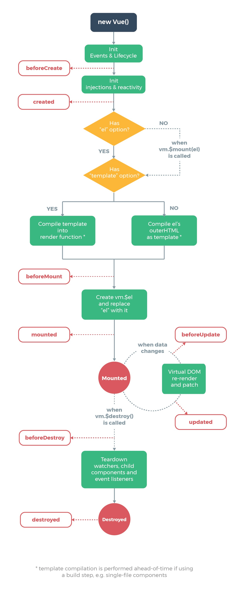

# vuejs

## 基础

兼容性 不支持 IE8及以下版本

稳定版 2.5.17

**安装引入方式**：

- 直接用 `<script>` 引入  直接下载并用`<script>` 标签引入 会被注册为一个全局变量

::: warning
开发环境不要使用压缩版本 会失去所有常见错误及警告！
:::

- CDN

```html
<script src="https://cdn.jsdelivr.net/npm/vue@2.5.17/dist/vue.js"></script>
```

- NPM

```bash
# 最新稳定版
$ npm install vue
```

**介绍**：

`vue` 是一套用于构建用户界面的渐进式框架, 自底向上逐层应用 `vue` 核心库只关注视图层

**Vue实例**：

- 创建一个`Vue`实例

```js
var vm = new Vue({
  //选项
})
```

- 数据和方法

实例被创建时，`data`对象中所有属性加入响应式系统。

:::tip
唯一例外的是使用 `Object.freeze()`， 会阻止修改现有的属性，意味着响应式系统无法再追踪变化。
:::

除了数据属性。`vue` 实例还暴有用的实例属性和方法($ 前缀)

- 实例生命周期钩子

`beforeCreate created`

`beforeMount mounted`

`beforeUpdate updated`

`beforeDestroy deatoryed`



**模版语法**：

`vuejs` 基于 `html` 模版语法

- 文本

`"Mustache"`语法

```html
<span>Message: {{ msg }}</span>
```

`v-once` 执行一次性插值

- 原始 HTML

使用`v-html`指令

- 特性

Mustache 语法不能作用在 HTML 特性上，遇到**布尔**特性的情况应该使用 `v-bind` 指令

```html
<div v-bind:id="dynamicId"></div>
```

- 使用 JavaScript 表达式

```js
{{ number + 1 }}

{{ ok ? 'YES' : 'NO' }}

{{ message.split('').reverse().join('') }}

<div v-bind:id="'list-' + id"></div>
```

**指令**：

指令 (Directives) 是带有 v- 前缀的特殊特性。

- 参数

一些指令能够接受一个参数，在指令后以冒号表示。例如，v-bind 指令可以用于响应式地更新 HTML 特性：

```html
<a v-bind:href="url">...</a>
```

- 修饰符

修饰符 (Modifiers) 是以半角句号 `.` 指明的特殊后缀，用于指出一个指令应该以特殊方式绑定。例如，.prevent 修饰符告诉 v-on 指令对于触发的事件调用 `event.preventDefault()`：

```html
<form v-on:submit.prevent="onSubmit">...</form>
```

- 缩写

Vue.js 为 v-bind 和 v-on 这两个最常用的指令，提供了特定简写：

v-bind 缩写

```html
<!-- 完整语法 -->
<a v-bind:href="url">...</a>

<!-- 缩写 -->
<a :href="url">...</a>
```

v-on 缩写

```html
<!-- 完整语法 -->
<a v-on:click="doSomething">...</a>

<!-- 缩写 -->
<a @click="doSomething">...</a>
```

**计算属性和侦听器**：

- 基础例子

```html
<div id="example">
  <p>Original message: "{{ message }}"</p>
  <p>Computed reversed message: "{{ reversedMessage }}"</p>
</div>
```

```js
var vm = new Vue({
  el: '#example',
  data: {
    message: 'Hello'
  },
  computed: {
    // 计算属性的 getter
    reversedMessage: function () {
      // `this` 指向 vm 实例
      return this.message.split('').reverse().join('')
    }
  }
})
```

```html
Original message: "Hello"

Computed reversed message: "olleH"
```

声明的计算属性将用作`vm`的属性的`getter`函数

- 计算属性缓存 VS 方法

计算属性是基于它们的依赖进行缓存的 只在相关依赖发生改变时它们才会重新求值

相比之下，每当触发重新渲染时，调用方法将总会再次执行函数。

- 计算属性 VS 侦听属性

TODO

- 计算属性的 `setter`

计算属性默认只有 `getter`,不过在需要时你也可以提供一个 setter ：

```js
// ...
computed: {
  fullName: {
    // getter
    get: function () {
      return this.firstName + ' ' + this.lastName
    },
    // setter
    set: function (newValue) {
      var names = newValue.split(' ')
      this.firstName = names[0]
      this.lastName = names[names.length - 1]
    }
  }
}
// ...
```

- 侦听器 `watch`

当需要在数据变化时**执行异步或开销较大**的操作时，这个方式是最有用的。

**Class 与 Style 绑定**：

- 绑定 Html Class

1.对象语法

可以为一个对象  动态的切换 Class

```html
<div v-bind:class="{ active: isActive }"></div>
```

上面语法表示 `active` 这个 class 存在与否取决于数据属性 `isActive`

也可以在对象中传入更多属性动态切换多个 `class` 此外`v-bind:class`也可以和普通 `class`属性共存 如下：

```html
<div class="static"
     v-bind:class="{ active: isActive, 'text-danger': hasError }"
>
</div>
```

```js
data: {
  isActive: true,
  hasError: false
}
```

渲染结果为：

```html
<div class="static active"></div>
```

绑定的对象不必内联定义在模版里 可以直接定义一个对象

```html
<div v-bind:class="classObject"></div>
```

```js
data: {
  classObject: {
    active: true,
    'text-danger': false
  }
}
```

也可以在这个绑定一个**返回对象的计算属性** 这是一个常用且强大的模式

```html
<div v-bind:class="classObject"></div>
```

```js
data: {
  isActive: true,
  error: null
},
computed: {
  classObject(){
    return {
      active: this.isActive && !this.error,
      'text-danger': this.error && this.error.type === 'fatal'
    }
  }
}
````

2.数组语法

我们可以把一个数组传给 v-bind:class, 以应用一个 class 列表

```html
<div v-bind:class= "[activeClass, errorClass]"></div>
```

```js
data: {
  activeClass: 'active',
  errorClass: 'text-danger'
}
```

渲染结果为：

```html
<div class="active text-danger"></div>
```

根据条件切换列表 class 三元表达式

```html
<div v-bind:class="[isActive ? activeClass : '', errorClass]"></div>
```

这样始终添加 `errorClass`, 只有 `isActive` 为 `true` 添加`activeClass`

多个条件 class会繁琐 数组中也可以使用对象语法

```html
<div v-bind:class="[{ active: isActive }, errorClass]"></div>
```

3.用在组件上

当一个自定义组件上使用 class 属性时，这些类将添加到该组件的根元素上面，元素上已经存在的类不会被覆盖。

例如。声明了这个组件：

```js
Vue.component('my-component',{
  template: '<p class="foo bar">Hi</p>'
})
```

然后使用时添加一些 class:

```html
<my-component class="baz boo"></my-component>
```

HTML 将被渲染为：

```html
<p class="foo bar baz boo"></p>
```

对于带数据绑定 class 也同样适用：

```html
<my-component :class="{ active: isActive}"></my-component>
```

当`isActive`为`true`,HTML 将被渲染为：

```html
<p class="foo bar active"></p>
```

- 绑定内联样式

1.对象语法

`v-bind:style` css属性名可以用驼峰式或短横线分割

```html
<div v-bind:style="{ color: activeColor, fontSize: fontSize + 'px'}"></div>
```

```js
data: {
  activeColor:'red',
  fontSize:30
}
```

直接绑定到一个样式对象通常更好 模版更清晰：

```html
<div v-bind:style="styleObject"></div>
```

```js
data: {
  styleObject: {
    color: 'red',
    fontSize: 30
  }
}
```

2.数组语法

```html
<div v-bind:style="[baseStyles, overridingStyles]"></div>
```

**条件渲染**：

- `v-if`

在 `<template>` 元素上使用 `v-if` 条件渲染分组

`v-else`元素必须紧跟在  `v-if` 或 `v-else-if`元素的后面 否则不会被识别

用唯一 `key` 值管理可复用当元素 完全独立 每次切换输入框将被**重新渲染**

- `v-show`

根据条件展示元素  不同的是  `v-show` 的元素始终会被渲染并保存在 DOM 中，`v-show` 只是切换元素的 `display` 属性

:::tip
注意，`v-show` 不支持 `<template>` 元素。也不支持 `v-else`
:::

- `v-if` vs `v-show`

`v-if` 是真正当条件渲染，因为它会确保在切换过程中条件内的事件监听器和子组件适当当被销毁和重建。如果初始渲染条件为假，则什么都不做，直到条件为真，才会渲染条件块。

`v-show` 不管初始条件是什么，元素总会被渲染。并且只是简单当基于css进行切换。

总的来说，`v-if`有更高的**切换开销**， `v-show`有更高的**初始渲染开销**，需要频繁切换`v-show`，条件改变比较少 `v-if`

- `v-if` 与 `v-for` 一起使用

`v-for` 比 `v-if` 优先级高

**列表渲染**：

1. `v-for`把一个数组对应为一组元素

`v-for`指令根据数组选项列表进行渲染 需要使用 `item in items` 形式的特殊语法 `items`是源数据数组  `item`是数组元素迭代当别名

```html
<ul id="example-1">
  <li v-for="item in items">
    {{ item.message }}
  </li>
</ul>
```

```js
var example1 = new Vue({
  e: '#example-1',
  data: {
    items: [
      { message: 'Foo' },
      { message: 'Bar' }
    ]
  }
})
```

渲染结果为：

```html
 Foo
 Bar
```

在 `v-for` 中，还支持可选第二个参数为当前项的索引。

2.一个对象的 `v-for`

也可以通过一个对象的属性来迭代

```html
<ul id="v-for-object">
  <li v-for="value in object">
  {{ value }}
  </li>
</ul>
```

```js
new Vue({
  el: '#v-for-object',
  data: {
    object: {
      firstName: 'John',
      lastName: 'Doe',
      age: 30
    }
  }
})
```

渲染结果为：

```html
John
Doe
30
```

:::tip
在遍历对象时，是按 `object.keys()` 的结果遍历， 但不能保证它的结果在不同的 JavaScript 引擎下是一致的
:::

3.`key`

默认“就地复用”策略 如数据项顺序被改变 vue 不会移动 DOM 来匹配数据项的顺序，而是简单复用此处每个元素

这个默认模式是高效的，但不适用**不依赖子组件状态或临时 DOM 状态（表单输入值）的列表渲染输出**

需要提供一个唯一的 `key` 属性,以便追踪每个节点的身份，从而重用和重新排序现有元素。

4.数组更新检测

**变异方法**: 会改变这些方法的原始数组

会触发视图更新

`push()`、 `pop()`、 `shift()`、 `unshift()`、 `splice()`、 `sort()`、 `reverse()`

**替换数组**:

相比之下，也有非变异方法，例如： `filter()` `concat()` `slice()`

这些不会改变原始数组，但会返回一个新数组，当使用非变异方法时，可以用新数组替换旧数组

```js
example1.items = example1.items.filter(function (item) {
  return item.message.match(/Foo/)
})
```

相同元素的数组去替换原来的数组是非常高效的操作

**注意事项**：

由于 JavaScript 的限制，Vue 不能检测以下变动的数组

1.当你利用索引直接设置一个项时，例如： `vm.items[indexOfItem] = newValue`

2.当你修改数组的长度时， 例如：`vm.items.length = newLength`

举个例子：

```js
var vm = new Vue({
  data: {
    items:[ 'a', 'b', 'c']
  }
})

vm.items[1] = 'x' // 不是响应性的
vm.items.length = 2  // 不是响应性的
```

有两种方式可以实现 `vm.items[indexOfItem] = newValue` 相同的效果，同时触发状态更新

```js
//vue set
Vue.set(vm.items, indexOfItem, newValue)
```

```js
//数组的方法 Array.prototype.splice
vm.items.splice(indexOfItem, 1, newValue)
```

也可以使用 `vm.$set` 实例方法， 全局方法 `Vue.set` 的别名：

```js
vm.$set(vm.items, indexOfItem, newValue)
```

为了解决第二类问题，可以使用 `splice`:

```js
//2.当你修改数组的长度时， 例如：`vm.items.length = newLength`
vm.items.splice(newLength)
```

5.对象更新检测注意事项

由于 JavaScript 的限制，Vue 不能检测对象属性的添加和删除：

```js
var vm = new Vue({
  data:{
    a: 1
  }
})
// `vm.a` 现在是响应式的

vm.b = 2
// `vm.b` 不是响应式的
```

对于已经创建的实例， Vue 不能动态添加根级别的响应式属性。但是，可以使用 `Vue.set(Pbject, key, value)` 向嵌套对象添加响应式属性。例如：

```js
var vm = new Vue({
  data: {
    userProfile: {
      name: 'Anika'
    }
  }
})
```

可以添加一个新的`age`属性到嵌套的`userProfile` 对象：

```js
Vue.set(vm.userProfile, 'age', 27)
```

也可以使用`vm.$set`

```js
vm.$set('userProfile', 'age', 27 )
```

有时可能需要为已有独享赋予多个新属性，比如使用 `Object.assgin()` 或 `_.extend()`。这种情况，**应该用两个对象的属性创建一个新对象**。

想要响应式属性，**不要这样** 如下：

```js
Object.activeClass(vm.userProfile, {
  age: 27,
  favoriteColor: 'Vue Green'
})
```

**要这样**:

```js
vm.userProfile = Object.assgin({}, vm.userProfile, {
  age: 27,
  favoriteColor: 'Vue Green'
})
```

6.显示过滤/排序结果

7.一段取值范围的 `v-for`

8.`v-for on a <template>`

9.`v-for` with `v-if`

10.一个组件的 `v-for`

**事件处理**：

**表单输入绑定**：

**组件基础**：

## 深入了解组件

**组件注册**：

**prop**：

**自定义事件**：

**插槽**：

**动态组件 & 异步组件**：

**处理边界情况**：

## 过渡 & 动画

**进入/离开 & 列表过渡**：

**状态过渡**：

## 可复用性 & 组合

**混入**：

**自定义指令**：

**渲染函数 & JSX**：

**插件**：

**过滤器**：

## 工具

**生产环境部署**：

**单文件组件**：

**单元测试**：

**TypeScript支持**：

## 模块化

**路由**：

**状态管理**：

**服务端渲染**：

## 内在

**深入响应式原理**：

## 迁移

**从 Vue1.x 迁移**：

**从 Vue Router 0.7x迁移**：

**从 Vuex 0.6x 迁移到 1.0**：

## 更多

**对比其他框架**：

**加入 vuejs 社区**：

**认识团队**：