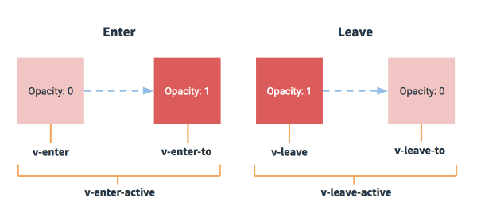

# vuejs

## 基础

兼容性 不支持 IE8及以下版本

稳定版 2.5.17

**安装引入方式**：

- 直接用 `<script>` 引入  直接下载并用`<script>` 标签引入 会被注册为一个全局变量

::: warning
开发环境不要使用压缩版本 会失去所有常见错误及警告！
:::

- CDN

```html
<script src="https://cdn.jsdelivr.net/npm/vue@2.5.17/dist/vue.js"></script>
```

- NPM

```bash
# 最新稳定版
$ npm install vue
```

**介绍**：

`vue` 是一套用于构建用户界面的渐进式框架, 自底向上逐层应用 `vue` 核心库只关注视图层

**Vue实例**：

- 创建一个`Vue`实例

```js
var vm = new Vue({
  //选项
})
```

- 数据和方法

实例被创建时，`data`对象中所有属性加入响应式系统。

:::tip
唯一例外的是使用 `Object.freeze()`， 会阻止修改现有的属性，意味着响应式系统无法再追踪变化。
:::

除了数据属性。`vue` 实例还暴有用的实例属性和方法($ 前缀)

- 实例生命周期钩子

`beforeCreate created`

`beforeMount mounted`

`beforeUpdate updated`

`beforeDestroy deatoryed`


**模版语法**：

`vuejs` 基于 `html` 模版语法

- 文本

`"Mustache"`语法

```html
<span>Message: {{ msg }}</span>
```

`v-once` 执行一次性插值

- 原始 HTML

使用`v-html`指令

- 特性

Mustache 语法不能作用在 HTML 特性上，遇到**布尔**特性的情况应该使用 `v-bind` 指令

```html
<div v-bind:id="dynamicId"></div>
```

- 使用 JavaScript 表达式

```js
{{ number + 1 }}

{{ ok ? 'YES' : 'NO' }}

{{ message.split('').reverse().join('') }}

<div v-bind:id="'list-' + id"></div>
```

**指令**：

指令 (Directives) 是带有 v- 前缀的特殊特性。

- 参数

一些指令能够接受一个参数，在指令后以冒号表示。例如，v-bind 指令可以用于响应式地更新 HTML 特性：

```html
<a v-bind:href="url">...</a>
```

- 修饰符

修饰符 (Modifiers) 是以半角句号 `.` 指明的特殊后缀，用于指出一个指令应该以特殊方式绑定。例如，.prevent 修饰符告诉 v-on 指令对于触发的事件调用 `event.preventDefault()`：

```html
<form v-on:submit.prevent="onSubmit">...</form>
```

- 缩写

Vue.js 为 v-bind 和 v-on 这两个最常用的指令，提供了特定简写：

v-bind 缩写

```html
<!-- 完整语法 -->
<a v-bind:href="url">...</a>

<!-- 缩写 -->
<a :href="url">...</a>
```

v-on 缩写

```html
<!-- 完整语法 -->
<a v-on:click="doSomething">...</a>

<!-- 缩写 -->
<a @click="doSomething">...</a>
```

**计算属性和侦听器**：

- 基础例子

```html
<div id="example">
  <p>Original message: "{{ message }}"</p>
  <p>Computed reversed message: "{{ reversedMessage }}"</p>
</div>
```

```js
var vm = new Vue({
  el: '#example',
  data: {
    message: 'Hello'
  },
  computed: {
    // 计算属性的 getter
    reversedMessage: function () {
      // `this` 指向 vm 实例
      return this.message.split('').reverse().join('')
    }
  }
})
```

```html
Original message: "Hello"

Computed reversed message: "olleH"
```

声明的计算属性将用作`vm`的属性的`getter`函数

- 计算属性缓存 VS 方法

计算属性是基于它们的依赖进行缓存的 只在相关依赖发生改变时它们才会重新求值

相比之下，每当触发重新渲染时，调用方法将总会再次执行函数。

- 计算属性 VS 侦听属性

TODO

- 计算属性的 `setter`

计算属性默认只有 `getter`,不过在需要时你也可以提供一个 setter ：

```js
// ...
computed: {
  fullName: {
    // getter
    get: function () {
      return this.firstName + ' ' + this.lastName
    },
    // setter
    set: function (newValue) {
      var names = newValue.split(' ')
      this.firstName = names[0]
      this.lastName = names[names.length - 1]
    }
  }
}
// ...
```

- 侦听器 `watch`

当需要在数据变化时**执行异步或开销较大**的操作时，这个方式是最有用的。

**Class 与 Style 绑定**：

- 绑定 Html Class

1.对象语法

可以为一个对象  动态的切换 Class

```html
<div v-bind:class="{ active: isActive }"></div>
```

上面语法表示 `active` 这个 class 存在与否取决于数据属性 `isActive`

也可以在对象中传入更多属性动态切换多个 `class` 此外`v-bind:class`也可以和普通 `class`属性共存 如下：

```html
<div class="static"
     v-bind:class="{ active: isActive, 'text-danger': hasError }"
>
</div>
```

```js
data: {
  isActive: true,
  hasError: false
}
```

渲染结果为：

```html
<div class="static active"></div>
```

绑定的对象不必内联定义在模版里 可以直接定义一个对象

```html
<div v-bind:class="classObject"></div>
```

```js
data: {
  classObject: {
    active: true,
    'text-danger': false
  }
}
```

也可以在这个绑定一个**返回对象的计算属性** 这是一个常用且强大的模式

```html
<div v-bind:class="classObject"></div>
```

```js
data: {
  isActive: true,
  error: null
},
computed: {
  classObject(){
    return {
      active: this.isActive && !this.error,
      'text-danger': this.error && this.error.type === 'fatal'
    }
  }
}
````

2.数组语法

我们可以把一个数组传给 v-bind:class, 以应用一个 class 列表

```html
<div v-bind:class= "[activeClass, errorClass]"></div>
```

```js
data: {
  activeClass: 'active',
  errorClass: 'text-danger'
}
```

渲染结果为：

```html
<div class="active text-danger"></div>
```

根据条件切换列表 class 三元表达式

```html
<div v-bind:class="[isActive ? activeClass : '', errorClass]"></div>
```

这样始终添加 `errorClass`, 只有 `isActive` 为 `true` 添加`activeClass`

多个条件 class会繁琐 数组中也可以使用对象语法

```html
<div v-bind:class="[{ active: isActive }, errorClass]"></div>
```

3.用在组件上

当一个自定义组件上使用 class 属性时，这些类将添加到该组件的根元素上面，元素上已经存在的类不会被覆盖。

例如。声明了这个组件：

```js
Vue.component('my-component',{
  template: '<p class="foo bar">Hi</p>'
})
```

然后使用时添加一些 class:

```html
<my-component class="baz boo"></my-component>
```

HTML 将被渲染为：

```html
<p class="foo bar baz boo"></p>
```

对于带数据绑定 class 也同样适用：

```html
<my-component :class="{ active: isActive}"></my-component>
```

当`isActive`为`true`,HTML 将被渲染为：

```html
<p class="foo bar active"></p>
```

- 绑定内联样式

1.对象语法

`v-bind:style` css属性名可以用驼峰式或短横线分割

```html
<div v-bind:style="{ color: activeColor, fontSize: fontSize + 'px'}"></div>
```

```js
data: {
  activeColor:'red',
  fontSize:30
}
```

直接绑定到一个样式对象通常更好 模版更清晰：

```html
<div v-bind:style="styleObject"></div>
```

```js
data: {
  styleObject: {
    color: 'red',
    fontSize: 30
  }
}
```

2.数组语法

```html
<div v-bind:style="[baseStyles, overridingStyles]"></div>
```

**条件渲染**：

- `v-if`

在 `<template>` 元素上使用 `v-if` 条件渲染分组

`v-else`元素必须紧跟在  `v-if` 或 `v-else-if`元素的后面 否则不会被识别

用唯一 `key` 值管理可复用当元素 完全独立 每次切换输入框将被**重新渲染**

- `v-show`

根据条件展示元素  不同的是  `v-show` 的元素始终会被渲染并保存在 DOM 中，`v-show` 只是切换元素的 `display` 属性

:::tip
注意，`v-show` 不支持 `<template>` 元素。也不支持 `v-else`
:::

- `v-if` vs `v-show`

`v-if` 是真正当条件渲染，因为它会确保在切换过程中条件内的事件监听器和子组件适当当被销毁和重建。如果初始渲染条件为假，则什么都不做，直到条件为真，才会渲染条件块。

`v-show` 不管初始条件是什么，元素总会被渲染。并且只是简单当基于css进行切换。

总的来说，`v-if`有更高的**切换开销**， `v-show`有更高的**初始渲染开销**，需要频繁切换`v-show`，条件改变比较少 `v-if`

- `v-if` 与 `v-for` 一起使用

`v-for` 比 `v-if` 优先级高

**列表渲染**：

1. `v-for`把一个数组对应为一组元素

`v-for`指令根据数组选项列表进行渲染 需要使用 `item in items` 形式的特殊语法 `items`是源数据数组  `item`是数组元素迭代当别名

```html
<ul id="example-1">
  <li v-for="item in items">
    {{ item.message }}
  </li>
</ul>
```

```js
var example1 = new Vue({
  e: '#example-1',
  data: {
    items: [
      { message: 'Foo' },
      { message: 'Bar' }
    ]
  }
})
```

渲染结果为：

```html
 Foo
 Bar
```

在 `v-for` 中，还支持可选第二个参数为当前项的索引。

2.一个对象的 `v-for`

也可以通过一个对象的属性来迭代

```html
<ul id="v-for-object">
  <li v-for="value in object">
  {{ value }}
  </li>
</ul>
```

```js
new Vue({
  el: '#v-for-object',
  data: {
    object: {
      firstName: 'John',
      lastName: 'Doe',
      age: 30
    }
  }
})
```

渲染结果为：

```html
John
Doe
30
```

:::tip
在遍历对象时，是按 `object.keys()` 的结果遍历， 但不能保证它的结果在不同的 JavaScript 引擎下是一致的
:::

3.`key`

默认“就地复用”策略 如数据项顺序被改变 vue 不会移动 DOM 来匹配数据项的顺序，而是简单复用此处每个元素

这个默认模式是高效的，但不适用**不依赖子组件状态或临时 DOM 状态（表单输入值）的列表渲染输出**

需要提供一个唯一的 `key` 属性,以便追踪每个节点的身份，从而重用和重新排序现有元素。

4.数组更新检测

**变异方法**: 会改变这些方法的原始数组

会触发视图更新

`push()`、 `pop()`、 `shift()`、 `unshift()`、 `splice()`、 `sort()`、 `reverse()`

**替换数组**:

相比之下，也有非变异方法，例如： `filter()` `concat()` `slice()`

这些不会改变原始数组，但会返回一个新数组，当使用非变异方法时，可以用新数组替换旧数组

```js
example1.items = example1.items.filter(function (item) {
  return item.message.match(/Foo/)
})
```

相同元素的数组去替换原来的数组是非常高效的操作

**注意事项**：

由于 JavaScript 的限制，Vue 不能检测以下变动的数组

1.当你利用索引直接设置一个项时，例如： `vm.items[indexOfItem] = newValue`

2.当你修改数组的长度时， 例如：`vm.items.length = newLength`

举个例子：

```js
var vm = new Vue({
  data: {
    items:[ 'a', 'b', 'c']
  }
})

vm.items[1] = 'x' // 不是响应性的
vm.items.length = 2  // 不是响应性的
```

有两种方式可以实现 `vm.items[indexOfItem] = newValue` 相同的效果，同时触发状态更新

```js
//vue set
Vue.set(vm.items, indexOfItem, newValue)
```

```js
//数组的方法 Array.prototype.splice
vm.items.splice(indexOfItem, 1, newValue)
```

也可以使用 `vm.$set` 实例方法， 全局方法 `Vue.set` 的别名：

```js
vm.$set(vm.items, indexOfItem, newValue)
```

为了解决第二类问题，可以使用 `splice`:

```js
//2.当你修改数组的长度时， 例如：`vm.items.length = newLength`
vm.items.splice(newLength)
```

5.对象更新检测注意事项

由于 JavaScript 的限制，Vue 不能检测对象属性的添加和删除：

```js
var vm = new Vue({
  data:{
    a: 1
  }
})
// `vm.a` 现在是响应式的

vm.b = 2
// `vm.b` 不是响应式的
```

对于已经创建的实例， Vue 不能动态添加根级别的响应式属性。但是，可以使用 `Vue.set(Pbject, key, value)` 向嵌套对象添加响应式属性。例如：

```js
var vm = new Vue({
  data: {
    userProfile: {
      name: 'Anika'
    }
  }
})
```

可以添加一个新的`age`属性到嵌套的`userProfile` 对象：

```js
Vue.set(vm.userProfile, 'age', 27)
```

也可以使用`vm.$set`

```js
vm.$set('userProfile', 'age', 27 )
```

有时可能需要为已有独享赋予多个新属性，比如使用 `Object.assgin()` 或 `_.extend()`。这种情况，**应该用两个对象的属性创建一个新对象**。

想要响应式属性，**不要这样** 如下：

```js
Object.activeClass(vm.userProfile, {
  age: 27,
  favoriteColor: 'Vue Green'
})
```

**要这样**:

```js
vm.userProfile = Object.assgin({}, vm.userProfile, {
  age: 27,
  favoriteColor: 'Vue Green'
})
```

6.显示过滤/排序结果

7.一段取值范围的 `v-for`

8.`v-for on a <template>`

9.`v-for` with `v-if`

10.一个组件的 `v-for`

**事件处理**：

1.监听事件

`v-on`监听 DOM 事件

2.事件处理方法

`v-on`接收一个需要调用的方法名称

3.内联处理器中的方法

除了绑定到一个方法，也可以在内联 JavaScript 语句中调用方法：

```html
<div id="example-3">
  <button v-on:click="say('hi')">Say Hi</button>
  <button v-on:click="say('what')">Say what</button>
</div>
```

```js
new Vue({
  el:"example-3",
  methods: {
    say(message){
      alert(message)
    }
  }
})
```

有时需要在内联语句处理器中访问原始 DOM 事件。可用特殊变量 `$event` 把它传入方法：

```html
<button v-on:click="warn('Form cannot be submitted yet.', $event)">Submit</button>
```

```js
methods: {
  warn(message.$event){
    //现在可以访问原生事件对象
    if(event) event.preventDefault()
    alert(message)
  }
}
```

4.事件修饰符

修饰符是用点开头的指令后缀表示

- `.stop`

- `.prevent`

- `.capture`

- `.self`

- `.once`

- `.passive`

```html
<!-- 阻止单击事件继续传播 -->
<a v-on:click.stop="doThis"></a>

<!-- 提交事件不再重载页面 -->
<form v-on:submit.prevent="onSubmit"></form>

<!-- 修饰符可以串联 -->
<a v-on:click.stop.prevent="doThat"></a>

<!-- 只有修饰符 -->
<form v-on:submit.prevent></form>

<!-- 添加事件监听器时使用事件捕获模式 -->
<!-- 即元素自身触发的事件先在此处理，然后才交由内部元素进行处理 -->
<div v-on:click.capture="doThis">...</div>

<!-- 只当在 event.target 是当前元素自身时触发处理函数 -->
<!-- 即事件不是从内部元素触发的 -->
<div v-on:click.self="doThat">...</div>
```

:::warning
使用修饰符时，顺序很重要；相应的代码会以同样的顺序产生。因此，用 v-on:click.prevent.self 会阻止所有的点击，而 v-on:click.self.prevent 只会阻止对元素自身的点击。
:::

> 2.1.4 新增

不像其它只能对原生的 DOM 事件起作用的修饰符，.once 修饰符还能被用到自定义的组件事件上。

```html
<!-- 点击事件将只会触发一次 -->
<a v-on:click.once="doThis"></a>
```

> 2.3.0 新增

Vue 还对应 `addEventLister` 中的 `passive` 选项提供了 `.passive`修饰符

主要是为了在阻止事件默认行为导致的卡顿

```html
<!-- 滚动事件的默认行为 (即滚动行为) 将会立即触发 -->
<!-- 而不会等待 `onScroll` 完成  -->
<!-- 这其中包含 `event.preventDefault()` 的情况 -->
<div v-on:scroll.passive="onScroll">...</div>
```

这个`.passive`修饰符尤其能够**提升移动端性能**

:::warning
不要把 .passive 和 .prevent 一起使用，因为 .prevent 将会被忽略，同时浏览器可能会向你展示一个警告。请记住，.passive 会告诉浏览器你不想阻止事件的默认行为。
:::

4.按键修饰符

```html
<!-- 只有在 `keyCode` 是 13 时调用 `vm.submit()` -->
<input v-on:keyup.13="submit">
```

按键别名

`.enter`

`.tab`

`.delete`

`.esc`

`.space`

`.up`

`.down`

`.left`

`.right`

```html
<!-- 同上 -->
<input v-on:keyup.enter="submit">

<!-- 缩写语法 -->
<input @keyup.enter="submit">
```

**通过全局 `config.keyCodes` 对象自定义按键修饰符别名**:

```js
// 可以使用 `v-on:keyup.f1`
Vue.config.keyCodes.f1 = 112
```

- 自动匹配按键修饰符

> 2.5.0 新增

你也可直接将 KeyboardEvent.key 暴露的任意有效按键名转换为 kebab-case 来作为修饰符：

```html
<input @keyup.page-down="onPageDown">
```

上面例子中。处理函数仅在 `$event.key === 'pageDown'` 时被调用

:::warning
有一些按键 (.esc 以及所有的方向键) 在 IE9 中有不同的 key 值, 如果你想支持 IE9，它们的内置别名应该是首选。
:::

5.系统修饰符

> 2.1.0 新增

可以用一下修饰符实现仅在按下相应按键时才触发鼠标或键盘事件的监听器

- `.ctrl`

- `.alt`

- `.shift`

- `.meta`

> `.exact`修饰符 2.5.0新增

允许你控制由精确的系统修饰符组合触发的事件

```html
<!-- 即使 Alt 或 Shift 被一同按下时也会触发 -->
<button @click.ctrl="onClick">A</button>

<!-- 有且只有 Ctrl 被按下的时候才触发 -->
<button @click.ctrl.exact="onCtrlClick">A</button>

<!-- 没有任何系统修饰符被按下的时候才触发 -->
<button @click.exact="onClick">A</button>
```

> 鼠标按钮修饰符 2.2.0 新增

- `.left`

- `.right`

- `.middle`

6.为什么在 HTML 中监听事件

- 能轻松定位 JavaScript 代码里对应的方法

- 无须在 `JavaScript`,手动绑定事件， `ViewModel` 代码非常纯粹 和 `Dom`完全解藕，更易于测试

- 当一个 `ViewModel` 被销毁时，所有事件处理器都会自动删除。

**表单输入绑定**：

> 基础用法：

`v-model` 在表单 `<input>`、 `<textarea>`、 `<select>`元素上创建双向数据绑定

:::warning
v-model 会忽略所有表单元素的 value、checked、selected 特性的初始值而总是将 Vue 实例的数据作为数据来源。你应该通过 JavaScript 在组件的 data 选项中声明初始值。
:::

- 文本

```html
<input v-model="message" placeholder="edit me">
<p>Message is: {{ message }}</p>
```

- 多行文本

```html
<span>Multiline message is:</span>
<p style="white-space: pre-line;">{{ message }}</p>
<br>
<textarea v-model="message" placeholder="add multiple lines"></textarea>
```

:::warning
在文本区域插值 (`<textarea></textarea>`) 并不会生效，应用 v-model 来代替。
:::

- 复选框

单个复选框 绑定到布尔值

多个复选框，绑定到同一个数组

- 单选按钮

- 选择框

```html
<div id="example-5">
  <select v-model="selected">
    <option disabled value="">请选择</option>
    <option>A</option>
    <option>B</option>
    <option>C</option>
  </select>
  <span>Selected: {{ selected }}</span>
</div>
```

```js
new Vue({
  el: '...',
  data: {
    selected: ''
  }
})
```

:::tip
如果 v-model 表达式的初始值未能匹配任何选项，`<select>` 元素将被渲染为“未选中”状态。在 iOS 中，这会使用户无法选择第一个选项。因为这样的情况下，iOS 不会触发 change 事件。因此，更推荐像上面这样提供一个值为空的禁用选项
:::

> 值绑定：

对于单选按钮。复选框及选择框的选项，`v-model` 绑定的值通常是静态字符串（对于复选框也可以是布尔值）：

```html
<!-- 当选中时，`picked` 为字符串 "a" -->
<input type="radio" v-model="picked" value="a">

<!-- `toggle` 为 true 或 false -->
<input type="checkbox" v-model="toggle">

<!-- 当选中第一个选项时，`selected` 为字符串 "abc" -->
<select v-model="selected">
  <option value="abc">ABC</option>
</select>
```

绑定到 Vue 实例的动态属性上，`v-bind`实现

- 复选框

- 单选按钮

- 选择框的选项

```html
<select v-model="selected">
    <!-- 内联对象字面量 -->
  <option v-bind:value="{ number: 123 }">123</option>
</select>
```

```js
// 当选中时
typeof vm.selected // => 'object'
vm.selected.number // => 123
```

> 修饰符：

- `.lazy`

默认情况下， `v-model` 在每次 `input`事件触发后将会更新，添加`.lazy`修饰符。将转变为使用 `change` 事件时同步：

```html
<!-- 在“change”时而非“input”时更新 -->
<input v-model.lazy="msg" >
```

- `.number`

自动把用户输入值转为数值类型

```html
<input v-model.number="age" type="number">
```

- `.trim`

自动过滤用户输入的首尾空白字符

```html
<input v-model.trim="msg" >
```

> 在组件上使用 `v-model`：

见下一节 **组件基础**

**组件基础**：

组件是**可复用的 Vue 实例**，且带有一个名字。所以他们与 `new vue`接收相同的选项，例如：`data`、`computed`、`watch`以及生命周期钩子，仅有的例外是像`el`这样根实例特有的选项

- 组件的复用

组件可以进行任意次数复用，每用一次组件，就会有一个它的新实例被创建。

**data必须是一个函数**：

因为每个实例可以维护一份被返回对象的独立拷贝

```js
data() {
  return {}
}
```

- 组件的组织

通常一个应用会以一棵嵌套的组件树形式来组织，为了能够在模版中使用，这些组件必须先注册以便 vue 能够识别。

这里两种组件注册类型： 全局注册和局部注册

- 通过 prop 向子组件递数据

prop 是你可以在组件上注册当一些自定义特性。当一个值传递给一个 prop 特性的时候，它就变成了那个组件实例的一个属性。可以用一个 `props` 选项将其包含在该组件可接受的 `prop`列表中

```js
Vue.component('blog-post', {
  props: ['title'],
  template: '<h3>{{ title }}</h3>'
})
```

一个组件默认可以拥有任意数量的 `prop`,任意值都可以传递给任何 `prop`。能够在组件实例中反问这个值，就像访问`data`中的值一样。

一个`prop`被注册后，就可以这样把数据作为一个自定义特性传递过来：

```html
<blog-post title="My journey with Vue"></blog-post>
<blog-post title="Blogging with Vue"></blog-post>
<blog-post title="Why Vue is so fun"></blog-post>
```

然而在一个典型应用中，可能在`data`中有一个博文的数组：

```js
new Vue({
  el: '#blog-post-demo',
  data: {
    posts: [
      { id: 1, title: 'My journey with Vue' },
      { id: 2, title: 'Blogging with Vue' },
      { id: 3, title: 'Why Vue is so fun' }
    ]
  }
})
```

并想要为每篇博文渲染一个组件：

```html
<blog-post
  v-for="post in posts"
  v-bind:key="post.id"
  v-bind:title="post.title"
></blog-post>
```

如上，`v-bind`可以动态传递`prop`

- 单个根元素

模板的内容包裹在一个父元素内

```html
<div class="blog-post">
  <h3>{{ title }}</h3>
  <div v-html="content"></div>
</div>
```

当组件变得复杂时，变成接受一个单独的prop:

```html
<blog-post
  v-for="post in posts"
  v-bind:key="post.id"
  v-bind:post="post"
></blog-post>
```

```js
Vue.component('blog-post', {
  props: ['post'],
  template: `
    <div class="blog-post">
      <h3>{{ post.title }}</h3>
      <div v-html="post.content"></div>
    </div>
  `
})
```

- 通过事件向父级组件发送消息

点击按钮需要告诉父组件要做的事情，vue 提供了自定义事件解决。可以调用内建的`$emit`方法并传入事件名，来向父组件触发一个事件：

```html
<button v-on:click="$emit('enlarge-text')">
  Enlarge text
</button>
```

然后在博文组件使用 `v-on` 监听这个事件

```html
<blog-post
  ...
  v-on:enlarge-text="postFontSize += 0.1"
></blog-post>
```

1.使用事件抛出一个值

使用`$emit`的第二个参数来抛出

```html
<button v-on:click="$emit('enlarge-text', 0.1)">
  Enlarge text
</button>
```

当父组件监听这个事件的时候，通过`$event`访问抛出的这个值：

```html
<blog-post
  ...
  v-on:enlarge-text="postFontSize += $event"
></blog-post>
```

或者，如果这个事件处理函数是一个方法：

```html
<blog-post
  ...
  v-on:enlarge-text="onEnlargeText"
></blog-post>
```

那么这个值将作为第一个参数传入这个方法：

```js
methods: {
  onEnlargeText: function (enlargeAmount) {
    this.postFontSize += enlargeAmount
  }
}
```

2.在组件上使用`v-model`

自定义事件也可以用于创建支持`v-model`的自定义输入组件

```html
 <input v-model="searchText">
```

等价于：

```html
<input
  v-bind:value="searchText"
  v-on:input="searchText = $event.target.value"
>
```

当用在组件上，`v-model`则会这样：

```html
<custom-input
  v-bind:value="searchText"
  v-on:input="searchText = $event"
></custom-input>
```

为了它正常工作，这个组件内的`<input>`必须：

1.将其 `value`特性绑定到一个名叫 `value`的`prop`上

2.在其`input`事件被触发时，将新当值通过自定义的`input`事件抛出。 代码如下：

```js
Vue.component('custom-input', {
  props: ['value'],
  template: `
    <input
      v-bind:value="value"
      v-on:input="$emit('input', $event.target.value)"
    >
  `
})
```

现在 `v-model` 就应该可以在这个组件上完美地工作起来了：

```html
<custom-input v-model="searchText"></custom-input>
```

- 通过插槽分发内容

需要向一个组件传递内容，像这样：

```html
<alert-box>
  Something bad happened.
</alert-box>
```

Vue `<slot>`

```js
Vue.component('alert-box', {
  template: `
    <div class="demo-alert-box">
      <strong>Error!</strong>
      <slot></slot>
    </div>
  `
})
```

只要在需要的地方加入插槽就行了

- 动态组件

不同组件进行状态切换，Vue的`<component>`元素加一个特殊的 `is` 特性来实现：

```html
<!-- 组件会在 `currentTabComponent` 改变时改变 -->
<component v-bind:is="currentTabComponent"></component>
```

`currentTabComponent`可以包括 已注册组件的名字 或 一个组件的选项对象。

- 解析 DOM 模版时的注意事项

有些 HTML 元素，如 `ul`、`ol`、`table`、`select`,对于哪些元素可以出现在内部是有限制的。而有些元素`li`、`tr`、`option`只能出现在特定元素内部。

这会导致一些问题：

```html
<table>
  <blog-post-row></blog-post-row>
</table>
```

这个自定义组件会被作为无效内容提升到外部，导致渲染结果出错。`is` 特性给出一个变通的方法：

```html
<table>
  <tr is="blog-post-row"></tr>
</table>
```

需要注意的是**如果从一下来源使用模版的话，这条限制是不存在的**：

1.字符串(例如：`template: '...'`)

2.单文件组件 (`.vue`)

3.`<script type="text/x-template">`

## 深入了解组件

**组件注册**：

- 组件名

W3C 规范中自定义组件名(字母全小写且必须包含一个连字符)

1.组件名大小写

两种方式：

**使用 kebab-case**：短横线分隔命名,定义一个组件时，你也必须在引用这个自定义元素时使用 kebab-case，例如 `<my-component-name>`。

**使用 PascalCase**: 驼峰式命名,引用这个自定义元素时两种命名法都可以使用。也就是说 `<my-component-name>`和 `<MyComponentName>` 都是可接受的

- 全局注册

这些组件是全局注册的。也就是说它们在注册之后可以用在任何新创建的 `Vue` 根实例 `(new Vue)` 的模板中。

```js
Vue.component('my-component-name', {
  // ... 选项 ...
})
```

- 局部注册

全局注册所有的组件意味着即便你已经不再使用一个组件了，它仍然会被包含在你最终的构建结果中。这造成了用户下载的 JavaScript 的无谓的增加。

在这些情况下，你可以通过一个普通的 JavaScript 对象来定义组件：

```js
var ComponentA = { /* ... */ }
```

然后在 components 选项中定义你想要使用的组件：

```js
new Vue({
  el: '#app'
  components: {
    'component-a': ComponentA
  }
})
```

对于 `components` 对象中的每个属性来说，其属性名就是自定义元素的名字，其属性值就是这个组件的选项对象。

**注意局部注册的组件在其子组件中不可用**，如果希望 `componentA`在`componentB` 中可用，需要这样写：

```js
var ComponentA = { /* ... */ }

var ComponentB = {
  components: {
    'component-a': ComponentA
  },
  // ...
}
```

或者通过 `Babel` 和 `webpack` 使用 `ES2015`模块：

```js
import ComponentA from './ComponentA.vue'

export default {
  components: {
    ComponentA
  },
  // ...
}
```

注意在 ES2015+ 中，在对象中放一个类似 `ComponentA` 的变量名其实是 `ComponentA: ComponentA` 的缩写，即这个变量名同时是：

1.用在模版中的自定义元素的名称

2.包含了这个组件选项的变量名

- 模块系统

`import`/`require`

1.在模块系统中局部注册

我们推荐创建一个 `components` 目录，并将每个组件放置在其各自的文件中。

例如，在一个假设的 ComponentB.js 或 ComponentB.vue 文件中：

```js
import ComponentA from './ComponentA'
import ComponentC from './ComponentC'

export default {
  components: {
    ComponentA,
    ComponentC
  },
  // ...
}
```

现在 `ComponentA` 和 `ComponentC` 都可以在 `ComponentB` 的模板中使用了。

2.基础组件的自动化全局注册

基础组件：只包裹了一个输入框或者按钮之类的元素。

使用`webpack`，就可以使用`require.context`只全局注册通用的基础组件。入口文件(如：`src/main.js`) 中全局导入基础组件的示例代码：

```js
import Vue from 'vue'
import upperFirst from 'lodash/upperFirst'
import camelCase from 'lodash/camelCase'

const requireComponent = require.context(
  // 其组件目录的相对路径
  './components',
  // 是否查询其子目录
  false,
  // 匹配基础组件文件名的正则表达式
  /Base[A-Z]\w+\.(vue|js)$/
)

requireComponent.keys().forEach(fileName => {
  // 获取组件配置
  const componentConfig = requireComponent(fileName)

  // 获取组件的 PascalCase 命名
  const componentName = upperFirst(
    camelCase(
      // 剥去文件名开头的 `./` 和结尾的扩展名
      fileName.replace(/^\.\/(.*)\.\w+$/, '$1')
    )
  )

  // 全局注册组件
  Vue.component(
    componentName,
    // 如果这个组件选项是通过 `export default` 导出的，
    // 那么就会优先使用 `.default`，
    // 否则回退到使用模块的根。
    componentConfig.default || componentConfig
  )
})
```

**记住全局注册的行为必须在根 Vue 实例 (通过 new Vue) 创建之前发生**。

**prop**：

- `prop`的大小写

HTML 中的特性名是大小写不敏感，这意味着当你使用 DOM 中的模板时，camelCase (驼峰命名法) 的 prop 名需要使用其等价的 kebab-case (短横线分隔命名) 命名：

```js
Vue.component('blog-post', {
  // 在 JavaScript 中是 camelCase 的
  props: ['postTitle'],
  template: '<h3>{{ postTitle }}</h3>'
})
```

```html
<!-- 在 HTML 中是 kebab-case 的 -->
<blog-post post-title="hello!"></blog-post>
```

如果你使用字符串模板，那么这个限制就不存在了。

- `prop`类型

以字符串数组形式列出的 prop：

```js
props: ['title', 'likes', 'isPublished', 'commentIds', 'author']
```

为每个 prop 都有指定的值类型

```js
props: {
  title: String,
  likes: Number,
  isPublished: Boolean,
  commentIds: Array,
  author: Object
}
```

- 传递静态或动态`prop`

像这样，你已经知道了可以像这样给 prop 传入一个静态的值：

```html
<blog-post title="My journey with Vue"></blog-post>
```

你也知道 prop 可以通过 v-bind 动态赋值，例如：

```html
<!-- 动态赋予一个变量的值 -->
<blog-post v-bind:title="post.title"></blog-post>

<!-- 动态赋予一个复杂表达式的值 -->
<blog-post v-bind:title="post.title + ' by ' + post.author.name"></blog-post>
```

在上述两个示例中，我们传入的值都是字符串类型的，但实际上任何类型的值都可以传给一个 prop。

1.传入一个数字

```html
<!-- 即便 `42` 是静态的，我们仍然需要 `v-bind` 来告诉 Vue -->
<!-- 这是一个 JavaScript 表达式而不是一个字符串。-->
<blog-post v-bind:likes="42"></blog-post>

<!-- 用一个变量进行动态赋值。-->
<blog-post v-bind:likes="post.likes"></blog-post>
```

2.传人一个布尔值

```html
<!-- 包含该 prop 没有值的情况在内，都意味着 `true`。-->
<blog-post is-published></blog-post>

<!-- 即便 `false` 是静态的，我们仍然需要 `v-bind` 来告诉 Vue -->
<!-- 这是一个 JavaScript 表达式而不是一个字符串。-->
<blog-post v-bind:is-published="false"></blog-post>

<!-- 用一个变量进行动态赋值。-->
<blog-post v-bind:is-published="post.isPublished"></blog-post>
```

3.传人一个数组

```html
<!-- 即便数组是静态的，我们仍然需要 `v-bind` 来告诉 Vue -->
<!-- 这是一个 JavaScript 表达式而不是一个字符串。-->
<blog-post v-bind:comment-ids="[234, 266, 273]"></blog-post>

<!-- 用一个变量进行动态赋值。-->
<blog-post v-bind:comment-ids="post.commentIds"></blog-post>
```

4.传人一个对象

```html
<!-- 即便对象是静态的，我们仍然需要 `v-bind` 来告诉 Vue -->
<!-- 这是一个 JavaScript 表达式而不是一个字符串。-->
<blog-post v-bind:author="{ name: 'Veronica', company: 'Veridian Dynamics' }"></blog-post>

<!-- 用一个变量进行动态赋值。-->
<blog-post v-bind:author="post.author"></blog-post>
```

5.传人一个对象的所有属性

可以使用不带参数的 `v-bind` (取代 v-bind:prop-name)。例如，对于一个给定的对象 `post`：

```js
post: {
  id: 1,
  title: 'My Journey with Vue'
}
```

模版：

```html
<blog-post v-bind="post"></blog-post>
```

等价于：

```html
<blog-post
  v-bind:id="post.id"
  v-bind:title="post.title"
></blog-post>
```

- 单向数据流

所有的 prop 都使得其父子之间形成一个单向下行绑定

两种常见的试图改变一个 `prop` 的情形：

1.`prop`用来传递一个初始值，这个子组件接下来希望将其作为一个本地的`prop`数据来使用。这种情况，最好定义一个本地的`data`属性并将`prop`用作初始值：

```js
props: ['initialCounter'],
data: function () {
  return {
    counter: this.initialCounter
  }
}
```

2.这个`prop`以一种原始的之传入且需要进行转换。最好定义一个计算属性：

```js
props: ['size'],
computed: {
  normalizedSize: function () {
    return this.size.trim().toLowerCase()
  }
}
```

:::tip
注意在 JavaScript 中对象和数组是通过引用传入的，所以对于一个数组或对象类型的 prop 来说，在子组件中改变这个对象或数组本身**将会影响到父组件的状态**。
:::

- `prop`验证

可以为组件的`prop`指定验证要求。不满足，(开发环境构建版本的)Vue 会在浏览器控制台警告。

```js
Vue.component('my-component', {
  props: {
    // 基础的类型检查 (`null` 匹配任何类型)
    propA: Number,
    // 多个可能的类型
    propB: [String, Number],
    // 必填的字符串
    propC: {
      type: String,
      required: true
    },
    // 带有默认值的数字
    propD: {
      type: Number,
      default: 100
    },
    // 带有默认值的对象
    propE: {
      type: Object,
      // 对象或数组默认值必须从一个工厂函数获取
      default: function () {
        return { message: 'hello' }
      }
    },
    // 自定义验证函数
    propF: {
      validator: function (value) {
        // 这个值必须匹配下列字符串中的一个
        return ['success', 'warning', 'danger'].indexOf(value) !== -1
      }
    }
  }
})
```

:::tip
注意那些 prop 会在一个组件实例创建之前进行验证，所以实例的属性 (如 data、computed 等) 在 `default` 或 `validator` 函数中是不可用的。
:::

> 类型检查

`type` 可以是下列构造函数中的一个：

`String`

`Number`

`Boolean`

`Array`

`Object`

`Date`

`Function`

`Symbol`

额外的，`type`还可以是一个自定义的构造函数，并通过`instanceof`来进行检查确认。例如，给定下列现成的构造函数：

```js
function Person(firstName, lastName) {
  this.fileName = firstName
  this.lastName = lastName
}
```

你可以这样使用： 来验证`author`prop 的值是否是`new Person`创建的。

```js
Vue.component('blog-post', {
  props: {
    author: Person
  }
})
```

- 非`prop`的特性

一个非 prop 特性是指传向一个组件，但该组件并没用相应 prop 定义的特性。

因为显式定义的 prop 适用于向一个子组件传入信息，但组件库的作者并不能预见组件会被用于怎样的场景，这也是为什么组件可以接受任意的特性，而这些特性会被添加到组件的根元素。

例如，通过一个 `Bootstrap` 使用了一个第三方组件 `<bootstrap-date-input>`,这个插件需要在`<input>`上用到`data-date-picker`特性，将特性添加到组件实例：

```html
<bootstrap-date-input data-date-picker="activated"></bootstrap-date-input>
```

然后这个`data-date-picker="activated"`特性会自动添加到 `<bootstrap-date-input>` 的根元素上。

1.替换/合并已有的特性

 `<bootstrap-date-input>`模版：

 ```html
 <input type="date" class="form-control">
 ```

 为了定制插件主题，添加一个类名：

 ```html
<bootstrap-date-input
  data-date-picker="activated"
  class="date-picker-theme-dark"
></bootstrap-date-input>
 ```

这种情况下，定义了两个不同的`class`的值：

1.`form-control`，组件模版内设置的

2.`date-picker-theme-dark`，组件的父级传入的

对于绝大多数特性来说，外部提供的值会替换内部的值。但 `class`和`style`会把两边合并起来，最终：

```js
form-control date-picker-theme-dark
```

2.禁止特性继承

不希望组件的根元素继承特性，组件选项中设置`inheritAttrs: false`。例如：

```js
Vue.component('my-component', {
  inheritAttrs: false,
  // ...
})
```

这尤其适合配合实例的 `$attrs` 属性使用

**自定义事件**：

- 事件名

事件名不存在任何自动化的大小写转换。触发一个 camelCase 名字的事件：

```js
this.$emit('myEvent')
```

则监听这个名字的 kebab-case 版本是不会有任何效果的：

```html
<my-component v-on:my-event="doSomething"></my-component>
```

`v-on` 事件监听器在 DOM 模板中会被自动转换为**全小写** (因为 HTML 是大小写不敏感的),

所以 `v-on:myEvent` 将会变成 `v-on:myevent`——导致 `myEvent` 不可能被监听到。

因此，我们**推荐你始终使用 kebab-case 的事件名**。

- 自定义组件的 v-model

> 2.2.0+ 新增

一个组件上的 `v-model` 默认会利用名为 `value`的 `prop`和名为`input`的事件，但是像单选框、复选框等类型的输入控件可能会将`value`特性用于不同的目的。 `model`可以避免这样的冲突：

```js
Vue.component('base-checkbox', {
  model: {
    prop: 'checked',
    event: 'change'
  },
  props: {
    checked: Boolean
  },
  template: `
    <input
      type="checkbox"
      v-bind:checked="checked"
      v-on:change="$emit('change', $event.target.checked)"
    >
  `
})
```

现在在这个组件上使用`v-model`时：

```html
<base-checkbox v-model="lovingVue"></base-checkbox>
```

这里的`lovingVue`的值会传入这个名为`checked`的`prop`，同时当`<base-checkbox >`触发`change`事件并附带一个新的值的时候，这个`lovingVue`的属性将会被更新。

:::tip
注意你仍然需要在组件的 props 选项里声明 checked 这个 prop。
:::

- 将原生事件绑定到组件

在一个组件的根元素上直接监听一个原生事件，使用`v-on`的`.native`修饰符：

```html
<base-input v-on:focus.native="onFocus"></base-input>
```

有时候很有用，不过监听类似`<input>`的非常特定的元素时，不是个好主意。比如`<base-input>`组件可能做了如下重构，根元素实际是一个`<label>`元素：

```html
<label>
  {{ label }}
  <input
    v-bind="$attrs"
    v-bind:value="value"
    v-on:input="$emit('input', $event.target.value)"
  >
</label>
```

这时，父级`.native`监听器静默失败，但不会报错。但是`onFocus`函数不会被调用。

Vue 提供了一个`$listeners`属性，解决这个问题。它是一个对象，包含了作用在这个组件上的所有监听器。例如：

```js
{
  focus: function (event) { /* ... */ }
  input: function (value) { /* ... */ },
}
```

配合`v-on="$listeners"`将所有的事件监听器指向这个组件某个特定的子元素。对于类似`<input>`希望配合 `v-model` 来说，为这些监听器创建一个计算属性通常是有用的：

```js
Vue.component('base-input', {
  inheritAttrs: false,
  props: ['label', 'value'],
  computed: {
    inputListeners: function () {
      var vm = this
      // `Object.assign` 将所有的对象合并为一个新对象
      return Object.assign({},
        // 我们从父级添加所有的监听器
        this.$listeners,
        // 然后我们添加自定义监听器，
        // 或覆写一些监听器的行为
        {
          // 这里确保组件配合 `v-model` 的工作
          input: function (event) {
            vm.$emit('input', event.target.value)
          }
        }
      )
    }
  },
  template: `
    <label>
      {{ label }}
      <input
        v-bind="$attrs"
        v-bind:value="value"
        v-on="inputListeners"
      >
    </label>
  `
})
```

- .sync修饰符

> 2.3.0 新增

有些情况,可能需要对一个`prop`进行双向绑定。

推荐以`update:my-prop-name`模式触发事件。

```js
this.$emit('update:title', newTitle)
```

父组件监听这个事件并根据需要更新一个本地的数据属性：

```html
<text-document
  v-bind:title="doc.title"
  v-on:update:title="doc.title = $event"
></text-document>
```

为了方便，提供缩写`.sync`修饰符：

```html
<text-document v-bind:title.sync="doc.title"></text-document>
```

当一个对象同时设置多个`prop`时，将这个`.sync`和`v-bind`配合使用：

```html
<text-document v-bind.sync="doc"></text-document>
```

这样会把`doc`对象中的每一个属性，如`title`作为一个独立的`prop`传进去，然后各自添加用于更新的`v-on`监听器。

:::tip
将 `v-bind.sync` 用在一个字面量的对象上，例如 `v-bind.sync=”{ title: doc.title }”`，是无法正常工作的，因为在解析一个像这样的复杂表达式的时候，有很多边缘情况需要考虑。
:::

**插槽**：

- 插槽内容

`<slot>`作为承载分发内容的出口。插槽内可以包含任何模版代码，包括 HTML：

```html
<navigation-link url="/profile">
  <!-- 添加一个 Font Awesome 图标 -->
  <span class="fa fa-user"></span>
  Your Profile
</navigation-link>
```

如果 `<navigation-link>` 没有包含一个 `<slot>` 元素，则任何传入它的内容都会被抛弃。

- 具名插槽

 `<slot>` 元素有一个特殊的特性： `name`。这个特性可以用来定义额外的插槽：

```html
<div class="container">
  <header>
    <slot name="header"></slot>
  </header>
  <main>
    <slot></slot>
  </main>
  <footer>
    <slot name="footer"></slot>
  </footer>
</div>
```

在向具名插槽提供内容的时候，可以在父组件的`<template>`上使用`<slot>`特性：

```html
<base-layout>
  <template slot="header">
    <h1>Here might be a page title</h1>
  </template>

  <p>A paragraph for the main content.</p>
  <p>And another one.</p>

  <template slot="footer">
    <p>Here's some contact info</p>
  </template>
</base-layout>
```

另一种`<slot>`特性的用法是直接用在一个普通元素上：

```html
<base-layout>
  <h1 slot="header">Here might be a page title</h1>

  <p>A paragraph for the main content.</p>
  <p>And another one.</p>

  <p slot="footer">Here's some contact info</p>
</base-layout>
```

我们还是可以保留一个未命名插槽，这个插槽是默认插槽。它会作为所有未匹配到插槽的内容的统一出口：

```html
<div class="container">
  <header>
    <h1>Here might be a page title</h1>
  </header>
  <main>
    <p>A paragraph for the main content.</p>
    <p>And another one.</p>
  </main>
  <footer>
    <p>Here's some contact info</p>
  </footer>
</div>
```

- 插槽的默认内容

有的时候为插槽提供默认的内容是很有用的。例如，一个 `<submit-button>` 组件可能希望这个按钮的默认内容是“Submit”，但是同时允许用户覆写为“Save”、“Upload”或别的内容。

你可以在 `<slot>` 标签内部指定默认的内容来做到这一点。

```html
<button type="submit">
  <slot>Submit</slot>
</button>
```

- 编译作用域

当你想在插槽内使用数据时，例如：

```html
<navigation-link url="/profile">
  Logged in as {{ user.name }}
</navigation-link>
```

该插槽可以访问跟这个模版的其他地方相同的实例属性，但不能访问`<navigation-link>`的作用域。例如访问`url`是不会工作的。牢记一条准则：

:::tip
父组件模板的所有东西都会在父级作用域内编译；子组件模板的所有东西都会在子级作用域内编译。
:::

- 作用域插槽

> 2.1.0+ 新增

有时候希望提供的组件带有一个可从子组件获取数据的可复用插槽。例如一个简单`<todo-list>`的组件的模版坑包含了如下代码：

```html
<ul>
  <li
    v-for="todo in todos"
    v-bind:key="todo.id"
  >
    {{ todo.text }}
  </li>
</ul>
```

希望每个独立的待办项渲染出和`todo.text`不太一样的东西。这就是作用域插槽的用武之地。

将待办项内容包裹子一个`<slot>`元素上，然后将所有和其上下文相关的数据传递给这个插槽，如下：

```html
<ul>
  <li
    v-for="todo in todos"
    v-bind:key="todo.id"
  >
    <!-- 我们为每个 todo 准备了一个插槽，-->
    <!-- 将 `todo` 对象作为一个插槽的 prop 传入。-->
    <slot v-bind:todo="todo">
      <!-- 回退的内容 -->
      {{ todo.text }}
    </slot>
  </li>
</ul>
```

现在当我们使用`<todo-list>`组件时，可以选择为待办项定义一个不一样的`<template>`作为替代方案，并且通过`slot-scope`特性从子组件获取数据：

```html
<todo-list v-bind:todos="todos">
  <!-- 将 `slotProps` 定义为插槽作用域的名字 -->
  <template slot-scope="slotProps">
    <!-- 为待办项自定义一个模板，-->
    <!-- 通过 `slotProps` 定制每个待办项。-->
    <span v-if="slotProps.todo.isComplete">✓</span>
    {{ slotProps.todo.text }}
  </template>
</todo-list>
```

:::tip
在 2.5.0+，`slot-scope` 不再限制在 `<template>` 元素上使用，而可以用在插槽内的任何元素或组件上
:::

- 解构`slot-scope`

如果一个 JavaScript 表达式在一个函数定义的参数位置有效，那么这个表达式实际上就可以被 `slot-scope` 接受。

```html
<todo-list v-bind:todos="todos">
  <template slot-scope="{ todo }">
    <span v-if="todo.isComplete">✓</span>
    {{ todo.text }}
  </template>
</todo-list>
```

这会使作用域插槽变得更干净一些。

**动态组件 & 异步组件**：

- 在动态组件上使用 `keep-alive`

组件实例在第一次被创建时缓存下来，用`<keep-alive>`元素将其动态组件包裹起来。

```html
<!-- 失活的组件将会被缓存！-->
<keep-alive>
  <component v-bind:is="currentTabComponent"></component>
</keep-alive>
```

:::tip
注意这个 `<keep-alive>` 要求被切换到的组件都有自己的名字，不论是通过组件的 name 选项还是局部/全局注册。
:::

- 异步组件

只有在这个组件需要被渲染时触发该工厂函数。例如：

```js
Vue.component('async-example', function (resolve, reject) {
  setTimeout(function () {
    // 向 `resolve` 回调传递组件定义
    resolve({
      template: '<div>I am async!</div>'
    })
  }, 1000)
})
```

这个工厂函数会收到一个`resolve`回调，这个回调函数会在你从服务器得到组件定义的时候被调用。

也可以调用`reject(reason)`表示加载失败。

一个推荐的做法是将异步组件和`webpack`的`code-splitting`功能配合使用：

```js
Vue.component('async-webpack-example', function (resolve) {
  // 这个特殊的 `require` 语法将会告诉 webpack
  // 自动将你的构建代码切割成多个包，这些包
  // 会通过 Ajax 请求加载
  require(['./my-async-component'], resolve)
})
```

也可以在工厂函数中返回一个`promise`,把`webpack 2` 和 `ES2015`语法加在一起，可以这样写：

```js
Vue.component(
  'async-webpack-example',
   // 这个 `import` 函数会返回一个 `Promise` 对象。
  ()=>import('./my-async-component')
)
```

局部注册的时候，也可以提供一个返回`promise`的函数：

```js
new Vue({
  // ...
  components: {
    'my-component': () => import('./my-async-component')
  }
})
```

:::tip
如果你是一个 `Browserify` 用户同时喜欢使用异步组件，很不幸这个工具的作者明确表示异步加载“并不会被 `Browserify` 支持”，至少官方不会。`Browserify` 社区已经找到了一些变通方案，这些方案可能会对已存在的复杂应用有帮助。对于其它的场景，我们推荐直接使用 `webpack`，以拥有内建的被作为第一公民的异步支持。
:::

> 处理加载状态 2.3.0+ 新增

这里的异步组件工厂函数也可以返回一个如下格式的对象：

```js
const AsyncComponent = () => ({
  // 需要加载的组件 (应该是一个 `Promise` 对象)
  component: import('./MyComponent.vue'),
  // 异步组件加载时使用的组件
  loading: LoadingComponent,
  // 加载失败时使用的组件
  error: ErrorComponent,
  // 展示加载时组件的延时时间。默认值是 200 (毫秒)
  delay: 200,
  // 如果提供了超时时间且组件加载也超时了，
  // 则使用加载失败时使用的组件。默认值是：`Infinity`
  timeout: 3000
})
```

:::tip
**注意如果你希望在 `Vue Router` 的路由组件中使用上述语法的话，你必须使用 `Vue Router` 2.4.0+ 版本。**
:::

**处理边界情况**：

- 访问元素 & 组件

1.访问根实例

在每个 `new Vue`实例的子组件中，其根实例可以通过`$toot`属性进行访问。如：在这个根实例中：

```js
// Vue 根实例
new Vue({
  data: {
    foo: 1
  },
  computed: {
    bar: function () { /* ... */ }
  },
  methods: {
    baz: function () { /* ... */ }
  }
})
```

所有的子组件都可以将这个实例作为一个全局`store`来访问或使用。

```js
// 获取根组件的数据
this.$root.foo

// 写入根组件的数据
this.$root.foo = 2

// 访问根组件的计算属性
this.$root.bar

// 调用根组件的方法
this.$root.baz()
```

:::tip
对于 `demo` 或非常小型的有少量组件的应用来说这是很方便的。绝大多数情况，推荐使用`Vuex`管理应用状态。
:::

2.访问父级组件实例

和 `$root` 类似，`$parent` 属性可以用来从一个子组件访问父组件的实例。

:::tip
绝大多数情况，触达父组件会使得应用更难调试和理解。尤其变更父组件数据的时候，很难找出变更是从哪里发起的。
:::

3.访问子组件实例或子元素

尽管存在`prop`和事件，有时候仍需要在 JavaScript 里直接访问一个子组件。可以通过`ref`为子组件赋予一个 ID 引用：

```html
<base-input ref="usernameInput"></base-input>
```

现在在定义了这个`ref`的组件里，可以使用：

```js
this.$refs.usernameInput
```

来访问这个`<base-input>`实例。

当`ref`和`v-for`一起使用的时候，得到当引用将会是一个包含来对应数据源的这些子组件的数组。

:::tip
`$refs` 只会在组件渲染完成之后生效，并且它们不是响应式的。这只意味着一个直接的子组件封装的“逃生舱”——你应该避免在模板或计算属性中访问 `$refs`。
:::

4.依赖注入

使用 `$parent` 属性无法很好的扩展到更深层级的嵌套组件上。这也是依赖注入的用武之地，它用到了两个新的实例选项：`provide` 和 `inject`。

`provide` 选项允许我们指定我们**想要提供给后代组件的数据/方法**。

```js
provide: function () {
  return {
    getMap: this.getMap
  }
}
```

在任何后代组件中，都可以用`inject`接受想要添加在这个实例上的属性：

```js
inject: ['getMap']
```

可以把依赖注入看作一部分`大范围有效的 prop`，除了：

1.祖先组件不需要知道哪些后代组件使用它提供的属性

2.后代组件不需要知道注入的属性来自哪里

:::tip
依赖注入是有负面影响的。它将组件组织方式耦合起来，使重构变得更困难。同时提供的属性是非响应式的。想要通用化，推荐`Vuex`。
:::

- 程序化的事件侦听器

Vue 实例同时在事件接口提供了其他方法：

通过`$on(eventName,eventHandler)` 侦听一个事件

通过`$once(eventName,eventHandler)` 一次性侦听一个事件

通过`$off(eventName,eventHandler)` 停止侦听一个事件

程序化侦听器解决问题：

```js
mounted: function () {
  var picker = new Pikaday({
    field: this.$refs.input,
    format: 'YYYY-MM-DD'
  })

  this.$once('hook:beforeDestroy', function () {
    picker.destroy()
  })
}
```

:::tip
`Vue` 的事件系统不同于浏览器的 `EventTarget API`.
但是 `$emit`、`$on`, 和 `$off` 并不是 `dispatchEvent`、`addEventListener` 和 `removeEventListener` 的别名。
:::

- 循环引用

1.递归组件

组件是可以在它们自己的模版中调用自身的，不过只能通过 `name`选项来做这件事：

```js
name: 'unique-name-of-my-component'
```

当你使用 `Vue.component` 全局注册一个组件时，这个全局的 ID 会自动设置为该组件的 `name` 选项。

```js
Vue.component('unique-name-of-my-component', {
  // ...
})
```

稍有不慎，递归组件就可能导致无限循环：

```js
name: 'stack-overflow',
template: '<div><stack-overflow></stack-overflow></div>'
```

类似上述的组件将会导致`“max stack size exceeded”`错误，所以请确保递归调用是条件性的 (例如使用一个最终会得到 `false` 的 `v-if`)。

2.组件之间的循环引用

父子组件互相依赖。会报错：

```bash
Failed to mount component: template or render function not defined
```

为了解决这个问题，需要给模版系统一个点。给父组件设置那个点，在子组件生命周期钩子`beforeCreate`时去注册它，或者本地注册组件时，使用`webpack`异步`import`:

```js
components: {
  TreeFolderContents: () => import('./tree-folder-contents.vue')
}
```

- 模版定义的替代品

1.内联模块

当`inline-template`这个特殊特性出现在子组件上，这个组件将会使用其里面当内容作为模版，而不是将其作为分发的内容。使得模版更加灵活。

```html
<my-component inline-template>
  <div>
    <p>These are compiled as the component's own template.</p>
    <p>Not parent's transclusion content.</p>
  </div>
</my-component>
```

:::tip
不过`inline-template`会让模版当作用域变得难以理解。作为最佳实践，优先选择`template`选项或`.vue`文件来定义模版
:::

2.X-templatess

另一种定义模版的方式是在一个`<script>`元素上，并为其带上`text/x-template`的类型，然后通过一个id将模版引用过去：

```html
<script type="text/x-template" id="hello-world-template">
  <p>Hello hello hello</p>
</script>
```

```js
Vue.component('hello-world', {
  template: '#hello-world-template'
})
```

:::tip
这些可以用于模板特别大的 demo 或极小型的应用，但是其它情况下请避免使用，因为这会将模板和该组件的其它定义分离开。
:::

- 控制更新

1.强制更新

通过 `$forceUpdate` 来做这件事。

2.通过 v-once 创建低开销的静态组件

可以在根元素上添加 `v-once`,确保这些内容只计算一次然后换存起来：

```js
Vue.component('terms-of-service', {
  template: `
    <div v-once>
      <h1>Terms of Service</h1>
      ... a lot of static content ...
    </div>
  `
})
```

:::tip
不要过度使用这个模式。当你需要渲染大量静态内容时，极少数的情况下它会给你带来便利，除非你非常留意渲染变慢了，不然它完全是没有必要的——再加上它在后期会带来很多困惑。例如，设想另一个开发者并不熟悉 `v-once` 或漏看了它在模板中，他们可能会花很多个小时去找出模板为什么无法正确更新。
:::

## 过渡 & 动画

Vue 在插入、更新、移除 DOM 时，提供多种不同方式的过渡效果。包括：

- 在css过渡和动画中自动应该 class

- 可以配合使用第三方css动画库，如 Animate.css

- 在过渡钩子函数中使用 JavaScript 直接操作 DOM

- 配合第三方 JavaScript动画库，如 Velocity.js

**进入/离开 & 列表过渡**：

- 单元素/组件的过渡

Vue 提供了 `transition` 的封装组件，在下列情形中，可以给任何元素和组件添加进入/离开过渡

1.条件渲染(`v-if`)

2.条件展示(`v-show`)

3.动态组件

4.组件根节点

当插入或删除包含在`transition`组件中的元素时，Vue 将会做以下处理：

1.自动嗅探目标元素是否应用了 css 过渡或动画，如果是，在恰当的时机添加/删除 Css 类名。

2.如果过渡组件提供了 JavaScript 钩子函数，这些钩子函数将在恰当当时机被调用。

3.如果没有找到 JavaScript 钩子并且没用检测到 css 过渡/动画，DOM 操作(插入/删除)在下一帧中立即执行。(指浏览器逐帧动画机制，不是 Vue 的 `nextTick`)

> 过渡的类名

在进入/离开过渡中，有6个 class 切换：

1. `v-enter` 定义进入过渡的开始状态。在元素被插入前生效，插入之后下一帧移除。

2. `v-enter-active` 定义进入过渡生效时的状态。元素插入之前生效，在过渡/动画完成之后移除。

3. `v-enter-to` 2.1.8及以上 定义进入过渡的结束状态。在元素被插入之后下一帧生效，在过渡/动画完成之后移除。与此`v-enter`被移除。

4. `v-leave` 定义离开过渡的开始状态。离开过渡被触发时立刻生效，下一帧被移除。

5. `v-leave-active` 定义离开过渡生效时的状态。离开过渡被触发时生效，过渡/动画完成移除。

6. `v-leave-to` 2.1.8及以上 定义离开过渡的结束状态。离开过渡被触发之后下一帧生效，过渡/动画完成之后移除，与此`v-leave`被删除。



对于这些在过渡中切换的类名来说，如果你使用一个没有名字的 `<transition>`，则 v- 是这些类名的默认前缀。如果你使用了 `<transition name="my-transition">`，那么 v-enter 会替换为 my-transition-enter。

> css 过渡

例子：

```html
<div id="example-1">
  <button @click="show = !show">
    Toggle render
  </button>
  <transition name="slide-fade">
    <p v-if="show">hello</p>
  </transition>
</div>
```

```js
new Vue({
  el: '#example-1',
  data: {
    show: true
  }
})
```

```css
/* 可以设置不同的进入和离开动画 */
/* 设置持续时间和动画函数 */
.slide-fade-enter-active {
  transition: all .3s ease;
}
.slide-fade-leave-active {
  transition: all .8s cubic-bezier(1.0, 0.5, 0.8, 1.0);
}
.slide-fade-enter, .slide-fade-leave-to
/* .slide-fade-leave-active for below version 2.1.8 */ {
  transform: translateX(10px);
  opacity: 0;
}
```

> css 动画

用法同 css 过渡。区别在动画中 `v-enter`类名在节点插入 DOM 后不会立即删除。而是在 `animationend` 事件触发时删除。

> 自定义过渡的类名

可以通过一下特性自定义过渡类名：

- `enter-class`

- `enter-active-class`

- `enter-to-class`(2.1.8+)

- `leave-class`

- `leave-active-class`

- `leave-to-class`(2.1.8+)

他们的优先级高于普通的类名。

示例：

```html
<div id="example-3">
  <button @click="show = !show">
    Toggle render
  </button>
  <transition
    name="custom-classes-transition"
    enter-active-class="animated tada"
    leave-active-class="animated bounceOutRight"
  >
    <p v-if="show">hello</p>
  </transition>
</div>
```

> 同时使用过渡和动画

Vue 为了知道过渡的完成，必须设置相应当事件监听器。它可以是`transitionend` 或 `animationend`，取决于给元素应用的 css 规则。使用任何一种，Vue都能自动识别类型并监听。

但是，在一些场景中，需要给同一个元素同时设置两种过渡动效，比如 `animation` 很快的被触发完成了，而 `transition`效果还没结束，在这种情况下，需要`type`特性并设置`animation`或`transition`来明确声明需要 Vue 监听的类型。

> 显性的过渡持续时间 2.2.0新增

很多情况下，Vue 可以自动得出过渡效果的完成时机。默认，Vue 会等待其在过渡效果的根元素的第一个 `transitionend`或`animationend`事件。然而也可以不这样，嵌套内部元素相比于过渡效果的根元素有延迟或更长的过渡效果。

可以用`<transition>`组件上的 `duration` 属性定制一个显性过渡持续事件(毫秒)：

```html
<transition :duration="1000">...</transition>
```

你也可以定制进入和移出的持续时间:

```html
<transition :duration="{ enter: 500, leave: 800 }">...</transition>
```

> JavaScript 钩子

可以在属性中声明 JavaScript 钩子

```html
<transition
  v-on:before-enter="beforeEnter"
  v-on:enter="enter"
  v-on:after-enter="afterEnter"
  v-on:enter-cancelled="enterCancelled"

  v-on:before-leave="beforeLeave"
  v-on:leave="leave"
  v-on:after-leave="afterLeave"
  v-on:leave-cancelled="leaveCancelled"
>
  <!-- ... -->
</transition>
```

```js
// ...
methods: {
  // --------
  // 进入中
  // --------

  beforeEnter: function (el) {
    // ...
  },
  // 此回调函数是可选项的设置
  // 与 CSS 结合时使用
  enter: function (el, done) {
    // ...
    done()
  },
  afterEnter: function (el) {
    // ...
  },
  enterCancelled: function (el) {
    // ...
  },

  // --------
  // 离开时
  // --------

  beforeLeave: function (el) {
    // ...
  },
  // 此回调函数是可选项的设置
  // 与 CSS 结合时使用
  leave: function (el, done) {
    // ...
    done()
  },
  afterLeave: function (el) {
    // ...
  },
  // leaveCancelled 只用于 v-show 中
  leaveCancelled: function (el) {
    // ...
  }
}
```

这些钩子函数可以结合 CSS `transitions/animations` 使用，也可以单独使用。

:::tip
当只用 JavaScript 过渡的时候，在 `enter` 和 `leave` 中必须使用 `done` 进行回调。否则，它们将被同步调用，过渡会立即完成。
:::

:::tip
推荐对于仅使用 JavaScript 过渡的元素添加 `v-bind:css="false"`，Vue 会跳过 CSS 的检测。这也可以避免过渡过程中 CSS 的影响。
:::

使用 `Velocity.js` 的简单例子：

`Velocity` 和 `jQuery.animate` 的工作方式类似，也是用来实现 JavaScript 动画的一个很棒的选择

- 初始渲染的过渡

可以通过 `appear` 特性设置节点在初始渲染的过渡

```html
<transition appear>
  <!-- ... -->
</transition>
```

这里默认和进入/离开过渡一样，同样也可以自定义 CSS 类名。

```html
<transition
  appear
  appear-class="custom-appear-class"
  appear-to-class="custom-appear-to-class" (2.1.8+)
  appear-active-class="custom-appear-active-class"
>
  <!-- ... -->
</transition>
```

自定义 JavaScript 钩子：

```html
<transition
  appear
  v-on:before-appear="customBeforeAppearHook"
  v-on:appear="customAppearHook"
  v-on:after-appear="customAfterAppearHook"
  v-on:appear-cancelled="customAppearCancelledHook"
>
  <!-- ... -->
</transition>
```

- 多个元素的过渡

```html
<transition>
  <table v-if="items.length > 0">
    <!-- ... -->
  </table>
  <p v-else>Sorry, no items found.</p>
</transition>
```

:::tip
当有**相同标签名的元素**切换时，需要通过 `key` 特性设置**唯一**的值来标记以让 `Vue` 区分它们，否则 `Vue` 为了效率只会替换相同标签内部的内容。即使在技术上没有必要，给在 `<transition>` 组件中的多个元素设置 `key` 是一个更好的实践。
:::

示例：

```html
<transition>
  <button v-if="isEditing" key="save">
    Save
  </button>
  <button v-else key="edit">
    Edit
  </button>
</transition>
```

在一些场景中，也可以通过给同一个元素的`key`特性设置不同的状态来代替`v-if`和`v-else`：

```html
<transition>
  <button v-bind:key="isEditing">
    {{ isEditing ? 'Save' : 'Edit' }}
  </button>
</transition>
```

使用多个 `v-if` 的多个元素可以重写为绑定了动态属性的单个元素过渡：

```html
<transition>
  <button v-if="docState === 'saved'" key="saved">
    Edit
  </button>
  <button v-if="docState === 'edited'" key="edited">
    Save
  </button>
  <button v-if="docState === 'editing'" key="editing">
    Cancel
  </button>
</transition>
```

重写：

```html
<transition>
  <button v-bind:key="docState">
    {{ buttonMessage }}
  </button>
</transition
```

```js
// ...
computed: {
  buttonMessage: function () {
    switch (this.docState) {
      case 'saved': return 'Edit'
      case 'edited': return 'Save'
      case 'editing': return 'Cancel'
    }
  }
}
```

同时生效的进入和离开的过渡不能满足所有要求，所以 Vue 提供了 **过渡模式**

1.`in-out` 新元素先进行过渡，完成之后当前元素过渡离开。

2.`out-in` 当前元素先进行，完成之后新元素过渡进入。

用 `out-in` 重写之前的开关按钮过渡：

```html
<transition name="fade" mode="out-in">
  <!-- ... the buttons ... -->
</transition>
```

`in-out`不常用

- 多个组件的过渡

只需要使用动态组件:

```html
<transition name="component-fade" mode="out-in">
  <component v-bind:is="view"></component>
</transition>
```

```js
new Vue({
  el: '#transition-components-demo',
  data: {
    view: 'v-a'
  },
  components: {
    'v-a': {
      template: '<div>Component A</div>'
    },
    'v-b': {
      template: '<div>Component B</div>'
    }
  }
})
```

```css
.component-fade-enter-active, .component-fade-leave-active {
  transition: opacity .3s ease;
}
.component-fade-enter, .component-fade-leave-to
/* .component-fade-leave-active for below version 2.1.8 */ {
  opacity: 0;
}
```

- 列表过渡

使用 `<transition-group>` 组件。特点：

1.不同于`<transition>`,它会以一个真实元素呈现，默认为一个`<span>`,也可以通过`tag`特性更换为其他元素

2.过渡模式不可用，因为不能相互切换特有的元素。

3.内部元素总是需要提供唯一的`key`值。

> 列表的进入/离开过渡

使用之前一样的 CSS 类名。

```html
<div id="list-demo" class="demo">
  <button v-on:click="add">Add</button>
  <button v-on:click="remove">Remove</button>
  <transition-group name="list" tag="p">
    <span v-for="item in items" v-bind:key="item" class="list-item">
      {{ item }}
    </span>
  </transition-group>
</div>
```

```js
new Vue({
  el: '#list-demo',
  data: {
    items: [1,2,3,4,5,6,7,8,9],
    nextNum: 10
  },
  methods: {
    randomIndex: function () {
      return Math.floor(Math.random() * this.items.length)
    },
    add: function () {
      this.items.splice(this.randomIndex(), 0, this.nextNum++)
    },
    remove: function () {
      this.items.splice(this.randomIndex(), 1)
    },
  }
})
```

```css
.list-item {
  display: inline-block;
  margin-right: 10px;
}
.list-enter-active, .list-leave-active {
  transition: all 1s;
}
.list-enter, .list-leave-to
/* .list-leave-active for below version 2.1.8 */ {
  opacity: 0;
  transform: translateY(30px);
}
```

> 列表的排序过渡

`<transition-group>`不仅可以进入/离开动画，还可以改变定位。`v-move`特性。会在元素改变定位的过程中应用。可以通过`name`属性自定义前缀，也可以通过`move-class`属性手动设置。

`v-move` 对于设置过渡切换和过渡曲线非常有用

```html
<script src="https://cdnjs.cloudflare.com/ajax/libs/lodash.js/4.14.1/lodash.min.js"></script>

<div id="flip-list-demo" class="demo">
  <button v-on:click="shuffle">Shuffle</button>
  <transition-group name="flip-list" tag="ul">
    <li v-for="item in items" v-bind:key="item">
      {{ item }}
    </li>
  </transition-group>
</div>
```

```css
.flip-list-move {
  transition: transform 1s;
}
```

:::tip
内部的实现，Vue 使用了一个叫 `FLIP` 简单的动画队列
使用 `transforms` 将元素从之前的位置平滑过渡新的位置。

需要注意的是使用 `FLIP` 过渡的元素不能设置为 `display: inline` 。作为替代方案，可以设置为 `display: inline-block` 或者放置于 `flex` 中
:::

**FLIP 动画不仅可以实现单列过渡，多维网格也同样可以过渡**.

> 列表的交错过渡

通过`data`属性与`JavaScript`通信，可以实现列表的交错过渡。

- 可复用的过渡

过渡可以通过 Vue 组件系统实现复用。要创建一个可复用过渡组件，需要将`<transition>` 或 `<transition-group>`作为根组件，然后将任何子组件放置其中就可以。

`render`函数更适合完成这个任务。

- 动态过渡

动态过渡是通过`name`特性来绑定动态值。

```html
<transition v-bind:name="transitionName">
  <!-- ... -->
</transition>
```

最后，创建动态过渡的最终方案是组件通过接受 props 来动态修改之前的过渡。

## 可复用性 & 组合

**混入**：

- 基础

`mixins`是一种分发 Vue 组件中可复用功能的方法。混入对象可以包含任意组件选项。

```js
// 定义一个混入对象
var myMixin = {
  created: function () {
    this.hello()
  },
  methods: {
    hello: function () {
      console.log('hello from mixin!')
    }
  }
}

// 定义一个使用混入对象的组件
var Component = Vue.extend({
  mixins: [myMixin]
})

var component = new Component() // => "hello from mixin!"
```

- 选项合并

- 全局混入

- 自定义选项合并策略

**自定义指令**：

**渲染函数 & JSX**：

**插件**：

**过滤器**：

## 工具

**生产环境部署**：

**单文件组件**：

**单元测试**：

**TypeScript支持**：

## 模块化

**路由**：

**状态管理**：

**服务端渲染**：

## 内在

**深入响应式原理**：

## 迁移

**从 Vue1.x 迁移**：

**从 Vue Router 0.7x迁移**：

**从 Vuex 0.6x 迁移到 1.0**：

## 更多

**对比其他框架**：

**加入 vuejs 社区**：

**认识团队**：