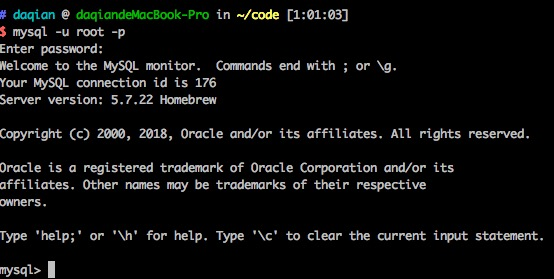
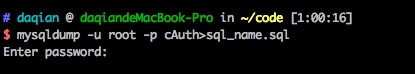

# Mpvue

## 启动mpvue

- vue npm run dev

- mysql

- server npm run dev

:::tip
node6.7以上版本支持

async await
:::

## mysql 进入退出

- 进入 mysql

```bash
mysql -u root -p
```



- 退出 mysql

```bash
exit
```


## 数据库的简单操作

```bash
// 查看数据库
show databases;

// 创建数据库
create database cAuth;

// 使用数据库
use cAuth;

// 删除数据库
drop database cAuth;
```

## 数据表的简单操作

```bash
//显示某个数据库中的所有表
show tables;

// 创建表（personId设置了关键值则不能重复）
create table personTable (personId int, name varchar(20), gender varchar(10), primary key(personId));

// 在表中添加新列
alter table personTable add age int;

// 查看表结构信息
desc personTable;

// 删除表
drop table personTable;

// 复制表
create table personInfo like personTable;
```

## 数据简单操作

```bash
// 查看数据
select * from personInfo; // 查询全部
select * from personInfo where age = 35; // 条件查询

// 插入数据
insert into personInfo (personId, name, gender, age) values (1000, 'devZhang', "male", 35);

// 更新数据
update personInfo set age = 25,name = "uiChen",gender='female' where personId = 1001;

// 删除数据
delete from personInfo where age = 23;
```

## mysql mac 导入导出.sql文件

导出

```bash
cd 『打开要将.sql文件生成的文件位置』
mysqldump -u root -p database_name>sql_name.sql
```



导入

```bash
mysql -u root -p
create database name;
use name;
source 『将.sql文件直接拖拽至终端，自动补全其文件目录』
```

## windows

- 安装 mysql

`https://dev.mysql.com/get/Downloads/MySQL-5.7/mysql-5.7.21-winx64.zip`, 下载后解压.

- 配置环境变量

- `我的电脑右键`-->`属性`-->`高级系统设置`-->`环境变量`

- 新建 `MYSQL_HOME` 变量，并将值设置为 `D:\soft\mysql-5.7.21-winx64`

- 编辑`Path`系统变量, 增加`;%MYSQL_HOME%\bin`

- 测试, cmd 中 `mysql -u root -p`

**报错**:

```bash
>mysql -u root -p
ERROR 1045 (28000): Access denied for user 'root'@'localhost' (using password: NO)
```

- 新建 my.ini

- `D:\soft\mysql-5.7.21-winx64` 目录新建 `my.ini`

```bash
[mysqld]
# set basedir to your installation path
basedir=D:\\soft\\mysql-5.7.21-winx64
# set datadir to the location of your data directory
datadir=D:\\soft\\mysql-5.7.21-winx64\\data
port = 3306
max_allowed_packet = 32M
```

**报错**:

```bash
C:\WINDOWS\system32>mysql -u root -p
Enter password: ******
ERROR 1045 (28000): Access denied for user 'root'@'localhost' (using password: YES)


找到配置文件my.ini
打开后，搜索mysqld关键字

找到后，在mysqld下面添加skip-grant-tables，保存退出。
保存后重启mySQL
输入mysql -u root -p就可以不用密码登录了，出现password：的时候直接回车可以进入。
```

## 几个命令

```bash
命令行窗口一定要用`管理员`模式打开
初始化安装data文件夹 `mysqld --initialize`
安装 `MySQL` 服务: `mysqld --install`
启动: `net start MySQL`
停止: `net stop MySQL`
卸载: `sc delete MySQL，mysqld -remove`
```

## windows 启动服务 修改密码

- `net start MySQL`

- `mysql -u root -p` 回车

- 出现 `ERROR 1045 (28000): Access denied for user 'root'@'localhost' (using password: NO)`

- 关闭服务 `net stop MySQL`

- 用安全模式打开，`mysqld --skip-grant-tablesmysqld --skip-grant-tables`

- 这个时候，光标会一直闪。注意，不要动，打开另一个命令行窗口

- 来到`bin`目录下, `mysql -u root -p`, 密码为空,直接回车, 就可以进去了

- use mysql;

```bash
（可能先前的版本密码的抬头是password，5.7.11是 authentication_string,可以select * from user,查看一下）

(老版本)update user set password=password("123456") where user="root";

（5.7.11）update user set authentication_string=password("123456") where user="root";

 最后，flush privileges;就OK了。
```

- 刚开始启动失败，是英文`mysqld`进程还开着呢，`kill`掉就行了。最后，成功修改了`root`密码。

 ```bash
  最后很重要，进去之后一定要设置密码，不然mysql会生成随机密码，第二次就进不去了！5.7.9设置密码的方式有一些变化，老版本密码是保存在mysql数据库user表的password中，而5.7.9的password字段变为了authentication_string，直接sql命令更改其值,再重启mysql服务即可！

  依次执行命令如下（设置密码为123456）：

  use mysql;

  update user set authentication_string="123456";

  exit;

  net stop mysql;

  net start mysql;

  mysql -u root -p

  [输入密码]
```

`原文: http://blog.csdn.net/ofreelander/article/details/50802780`