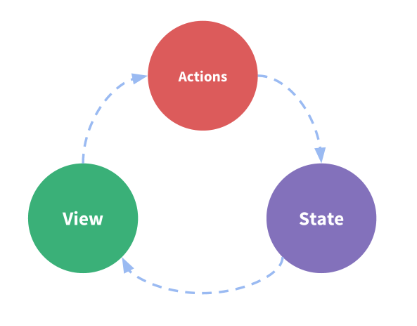

# Vuex

## 安装

- NPM

```shell
npm install  vuex --save
```

在一个模块化的`打包系统`中，您必须显式地通过 `Vue.use()`来安装 Vuex：

```js
import Vue from 'vue'
import Vuex from 'vuex'

Vue.use(Vuex)
```

## Vuex 是什么

状态管理工具，包含一下几个部分：

- State 驱动应用的数据源

- View 将 state 映射到视图

- Action 用户输入导致的状态变化

“单向数据流”极简示意：



把组件共享状态抽取出来，以一个全局单例模式管理，组件树构成一个视图，任何组件都能获取状态或者触发行为。


## 开始

Vuex 应用核心就是 Store，包含着状态(state)。

Vuex 和 单纯全局对象的区别：

1.Vuex 状态存储是响应式的。

2.不能直接改变 `store` 中的状态。唯一方式是通过 `commit` 提交 `Mutation`

### 最简单的 Store

```js
// 如果在模块化构建系统中，请确保在开头调用了 Vue.use(Vuex)

const store = new Vuex.Store({
  state: {
    count: 0
  },
  mutations: {
    increment (state) {
      state.count++
    }
  }
})
```

通过 `store.state` 来获取状态对象，以及通过 `store.commit` 方法触发状态变更：

```js
store.commit('increment')

console.log(store.state.count) // -> 1
```

## 核心概念

### State

单一状态树

唯一数据源

一个对象包含了全部的应用层级状态

#### 在 Vue 组件中获得 Vuex 状态

vuex 是响应式的，通过计算属性 `computed`返回某个状态

```js
computed:{
  count() {
    return store.state.count
  }
}
```

`store.state.count`变化的时候，都会重新计算，触发更新 DOM

Vuex 通过 `store`选项，将根组件注入到每个子组件中，需调用 `vue.use(vuex)`,子组件通过 `this.$store`可以访问到。

#### `mapState`辅助函数

`mapState`函数返回一个对象。使用对象展开运算符展开对象

```js
computed: {
  localComputed () { /* ... */ },
  // 使用对象展开运算符将此对象混入到外部对象中
  ...mapState({
    // ...
  })
}
```

### Getter

需要在`store`中的 `state`派生去一些状态。

就像计算属性，`getter` 的返回值会根据依赖被缓存。

`getter` 接受 `state` 作为第一个参数：

```js
const store = new Vuex.Store({
  state: {
    todos: [
      { id: 1, text: '...', done: true },
      { id: 2, text: '...', done: false }
    ]
  },
  getters: {
    doneTodos: state => {
      return state.todos.filter(todo => todo.done)
    }
  }
})
```

`Getter`会暴露为 `store.getter` 对象，可以以属性的形式访问这些值：

```js
store.getters.doneTodos // -> [{ id: 1, text: '...', done: true }]
```

#### `mapGetters`辅助函数

将 `store` 中的 `getter` 映射到局部计算属性

```js
import { mapGetters } from 'vuex'

export default {
  // ...
  computed: {
  // 使用对象展开运算符将 getter 混入 computed 对象中
    ...mapGetters([
      'doneTodosCount',
      'anotherGetter',
      // ...
    ])
  }
}
```

getter 另取一个名字：

```js
mapGetters({
  // 把 `this.doneCount` 映射为 `this.$store.getters.doneTodosCount`
  doneCount: 'doneTodosCount'
})
```

### Mutation

更改 vuex 的 `store`中的状态唯一的方法是提交 `mutation`。

每个`mutation`都有一个字符串**事件类型(type)**和一个**回调函数(handler)**。

`mutation`回调函数就是我们实际进行状态更改的地方，接受`state`作为第一个参数：

```js
const store = new Vuex.Store({
  state: {
    count: 1
  },
  mutations: {
    increment (state) {
      // 变更状态
      state.count++
    }
  }
})
```

不能直接调用 `mutation.handler`,需要以相应的 type 调用 `store.commit`方法。

```js
store.commit('increment')
```

#### 提交载荷(payload)

`store.commit` 传入额外的参数，即 `Mutation` 的载荷。

```js
store.commit('increment', 10)
```

大多数情况，载荷应该是一个对象：

```js
store.commit('increment', {
  amount: 10
})
```

#### 对象风格的提交方式

提交 `mutation`另一种方式是： 直接使用包含`type`属性的对象：

```js
store.commit({
  type: 'increment',
  amount: 10
})
```

#### Mutation 需遵守 vue 的响应规则

1.提前在`store`中初始化所有所需属性

2.当需要在对象上添加新属性时，应该

- 使用`Vue.set()` 或者

- 以新对象替换老对象，利用对象展开运算符，可以这样写了：

```js
state.obj = { ...state.obj, newProp: 123}
```

#### 使用常量代替 Mutation 事件类型

把常量放在单独的文件。

使整个 app 包含的 mutation 一目了然

```js
// mutation-types.js
export const SOME_MUTATION = 'SOME_MUTATION'
```

```js
// store.js
import Vuex from 'vuex'
import { SOME_MUTATION } from './mutation-types'

const store = new Vuex.Store({
  state: { ... },
  mutations: {
    // 我们可以使用 ES2015 风格的计算属性命名功能来使用一个常量作为函数名
    [SOME_MUTATION] (state) {
      // mutate state
    }
  }
})

```

:::tip
**Mutation 必须是同步函数**
:::

#### 在组件中提交 Mutation

组件中使用 `this.$store.commit('xxx')`提交

使用 `MapMutations`辅助函数将组件中的 `methods`映射为 `store.commit` 调用

```js
import { mapMutations } from 'vuex'

export default {
  // ...
  methods: {
    ...mapMutations([
      'increment', // 将 `this.increment()` 映射为 `this.$store.commit('increment')`

      // `mapMutations` 也支持载荷：
      'incrementBy' // 将 `this.incrementBy(amount)` 映射为 `this.$store.commit('incrementBy', amount)`
    ]),
    ...mapMutations({
      add: 'increment' // 将 `this.add()` 映射为 `this.$store.commit('increment')`
    })
  }
}
```

### Action

:::tip
**异步**
:::

Action 类似 Mutation,不同在于：

- Action 提交的的是 Mutation，而不是直接变更状态

- Action 可以包含任意异步操作

```js
const store = new Vuex.Store({
  state: {
    count: 0
  },
  mutations: {
    increment (state) {
      state.count++
    }
  },
  actions: {
    increment (context) {
      context.commit('increment')
    }
  }
})
```

Action 接受一个和 store 实例相同方法和属性的`context`对象。可以通过`context.commit`提交`mutation`,或者通过 `context.state`和 `context.getter`获取state 和 getters

ES2015简化代码：

```js
actions: {
  increment ({ commit }) {
    commit('increment')
  }
}
```

#### 分发Action

Action 通过 `store.dispatch` 方法触发

#### 在组件中分发Action

在组件中使用`this.$store.dispatch('xxx')` 分发Action

或者使用`mapActions`辅助函数将组件 `methods`映射会`store.dispatch`调用

```js
import { mapActions } from 'vuex'

export default {
  // ...
  methods: {
    ...mapActions([
      'increment', // 将 `this.increment()` 映射为 `this.$store.dispatch('increment')`

      // `mapActions` 也支持载荷：
      'incrementBy' // 将 `this.incrementBy(amount)` 映射为 `this.$store.dispatch('incrementBy', amount)`
    ]),
    ...mapActions({
      add: 'increment' // 将 `this.add()` 映射为 `this.$store.dispatch('increment')`
    })
  }
}
```

#### 组合 Action

`store.dispatch`返回 `promise`,可以使用 `.then()`或者`async/await`

### Module

将 `store` 分割成 模块。

每个模块有自己的 state 、mutation 、action 、getter  

```js
const moduleA = {
  state: { ... },
  mutations: { ... },
  actions: { ... },
  getters: { ... }
}

const moduleB = {
  state: { ... },
  mutations: { ... },
  actions: { ... }
}

const store = new Vuex.Store({
  modules: {
    a: moduleA,
    b: moduleB
  }
})

store.state.a // -> moduleA 的状态
store.state.b // -> moduleB 的状态
```

#### 模块的局部状态

对于模块内部的 `mutation`和 `getter`,接受的第一个参数就是模块的局部状态。

## 项目结构

```shell
├── index.html
├── main.js
├── api
│   └── ... # 抽取出API请求
├── components
│   ├── App.vue
│   └── ...
└── store
    ├── index.js          # 我们组装模块并导出 store 的地方
    ├── actions.js        # 根级别的 action
    ├── mutations.js      # 根级别的 mutation
    └── modules
        ├── cart.js       # 购物车模块
        └── products.js   # 产品模块
```

## 插件

## 严格模式

## 表单处理

## 测试

## 热重载