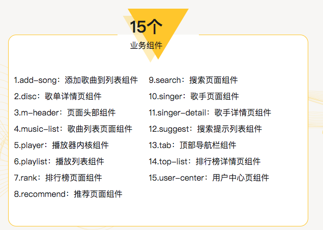
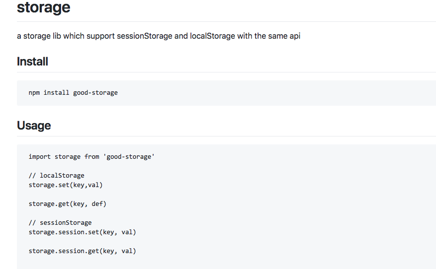
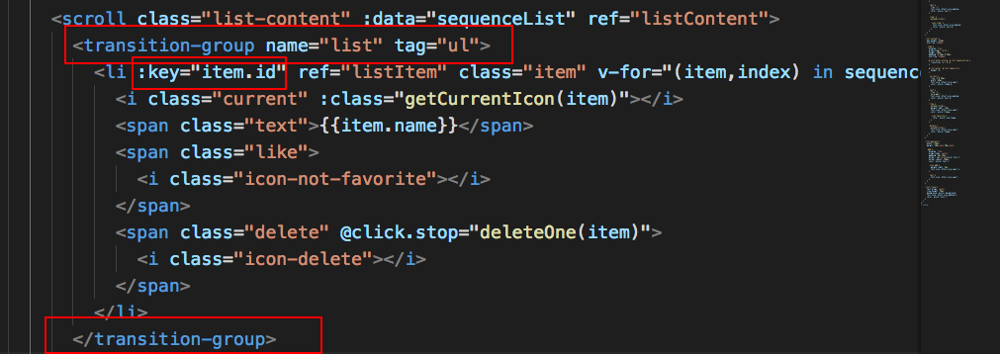
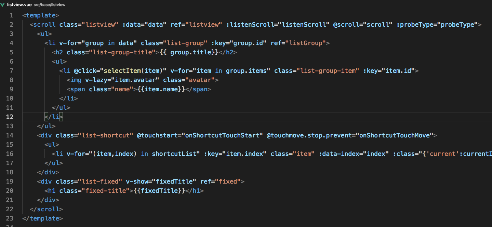

# vueMusic

## vue cli

推荐页(轮播图) 推荐歌单列表 歌单详情页(图片，歌单列表) 歌手页面 歌手详情页 播放器内核 搜索页面 排行榜 歌曲列表 用户中心页...

vue vuex vue-router axios jsonp

第三方插件 better-scroll v-lazyload animation loading jsonp

滚动位置自适应高度 mixin抽象 动画 高斯模糊 节流 播放器动画

歌手列表 滑动 类通讯录组件的实现 左右联动 索引 头像懒加载

```js
debounce 函数所做的事情就是，强制一个函数在某个连续时间段内只执行一次，哪怕它本来会被调用多次。
this.$watch(
      'query',
      debounce(newQuery => {
        this.$emit('query', newQuery)
      }, 200)
    )
debounce 函数接收两个参数，第一个是要“去弹跳”的回调函数 fn，第二个是延迟的时间 delay。
debounce(去抖) 强制函数在某段时间内只执行一次，将一个连续的调用归为一个！输入停止之后再执行的行为
throttle(节流) 强制函数以固定的速率执行
```

```shell
npm install stylus stylus-loader --save-dev
```

## 组件




## 修改 eslint 规则

```js
//.eslintrc.js 配置rules 修改 eslint 规则
 'eol-last': 0,
    'space-before-function-paren': 0
```

## webpack 配置别名

```js
//webpack.base.conf.js  webpack 基本配置 alias别名
resolve: {
  extensions: ['.js', '.vue', '.json'],
  alias: {
    '@': resolve('src'),
    'common': resolve('src/common'),
  }
```

:::tip
修改配置项  需要重启服务
:::

## 路由重定向

- redirect

## jsonp原理

动态创建 `<script>` 标签 src 指向服务端地址 callback

```js
https://github.com/webmodules/jsonp
```

## 浏览器刷新 17 毫秒一次

## vue-lazyload

`https://github.com/hilongjw/vue-lazyload`

## click冲突问题(scroll)

```css
//添加 class
class="needsclick"
```

## 滚动 better-scroll

```js
https://github.com/ustbhuangyi/better-scroll

// better-scroll 对外暴露了一个 BScroll 的类
import BScroll from 'better-scroll'
let wrapper = document.querySelector('.wrapper')
// new 一个类的实例即可 第一个参数就是我们 wrapper 的 DOM 对象，第二个是一些配置参数
let scroll = new BScroll(wrapper, {})
```

### 异步处理

this.$refs.wrapper访问到了这个 DOM 对象

保证 DOM 已经渲染  `this.$nextTick`

或者调用 `scroll` 的 `refresh()`

```js
setTimeout(() => {
  this.$refs.listContent.refresh()
}, 20)
```

### 下拉刷新

滑动列表松开手指时候， better-scroll 会对外派发一个 `touchend` 事件

绑定一些事件，否则我们会调用 this.scroll.refresh 方法重新计算，来确保滚动效果的正常。

```js
 <div class="progress-btn-wrapper"
           ref="progressBtn"
          @touchstart.prevent="progressTouchStart"
          @touchmove.prevent="progressTouchMove"
          @touchend="progressTouchEnd">
        <div class="progress-btn"></div>
      </div>
```

### 抽象出 scroll 组件

根据需求 传`props`

通过`methods`暴露出方法做代理

## 解析歌词

```js
https://github.com/ustbhuangyi/lyric-parser

 import Lyric from 'lyric-parser'
 let lyric = new Lyric(lyricStr, handler)

 function hanlder({lineNum, txt}){
   // this hanlder called when lineNum change
 }
```

## create-keyframe-animation

`https://github.com/HenrikJoreteg/create-keyframe-animation`

## 搜索

### 截流

### 搜索历史 根据localstorage searchHistory 是否展示

```js
https://github.com/ustbhuangyi/storage
```



- 点 x 拉家桶 清空本地存储 vuex数据

- mapMutations methods 改变store状态的方法 提交mutations 改数据

- mapGetters 映射到computed getter 派生一些状态state  返回getter返回值  取数据

- mapActions 将组件 methods 映射为 store.dispatch 分发action

- action 类似 mutation

action 提交的是状态 不是直接变更状态

## audio

```js
 <audio :src="currentSong.url" ref="audio"
            @canplay="ready"
            @error="error"
            @timeupdate="updateTime"
            @ended="end"></audio>
```

## transition-group



## 歌手字母

`listview`



```js
    onShortcutTouchStart(e) {
      let anchorIndex = getData(e.target, 'index')
      let firstTouch = e.touches[0]
      this.touch.y1 = firstTouch.pageY
      this.touch.anchorIndex = anchorIndex
      this._scrollTo(anchorIndex)
    },
    _scrollTo(index) {
      if (!index && index !== 0) {
        return
      }
      if (index < 0) {
        index = 0
      } else if (index > this.listHeight.lenth - 2) {
        index = this.listHeight.length - 2
      }
      // 点击字母高亮
      this.scrollY = -this.listHeight[index]
      this.$refs.listview.scrollToElement(this.$refs.listGroup[index], 0)
    }  
```

## 歌曲状态

## router配置子路由

```js
export default new Router({
  routes: [
    {
      path: '/',
      redirect: '/recommend'
    },
    {
      path: '/recommend',
      component: Recommend,
      children: [
        {
          path: ':id',
          component: Disc
        }
      ]
    }
  ]
```

## 移动端调试 抓包

### Vconsole 手机上的控制台

`https://github.com/Tencent/vConsole`

## charles