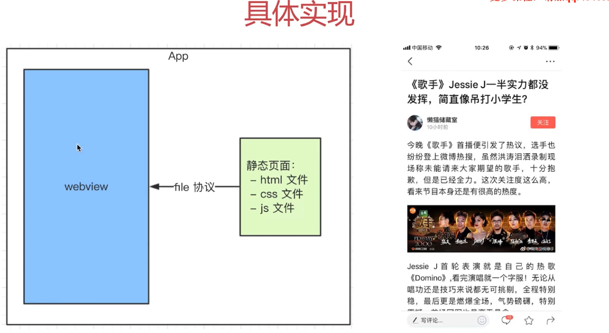
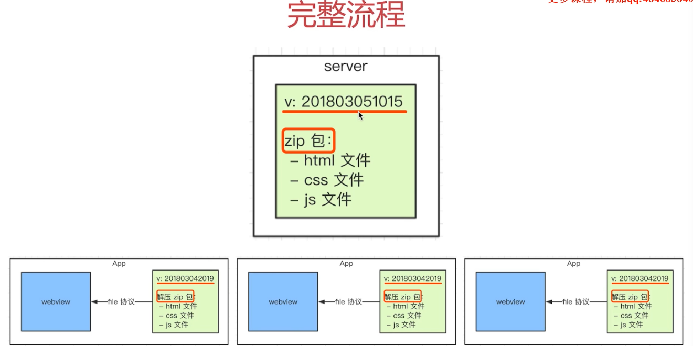
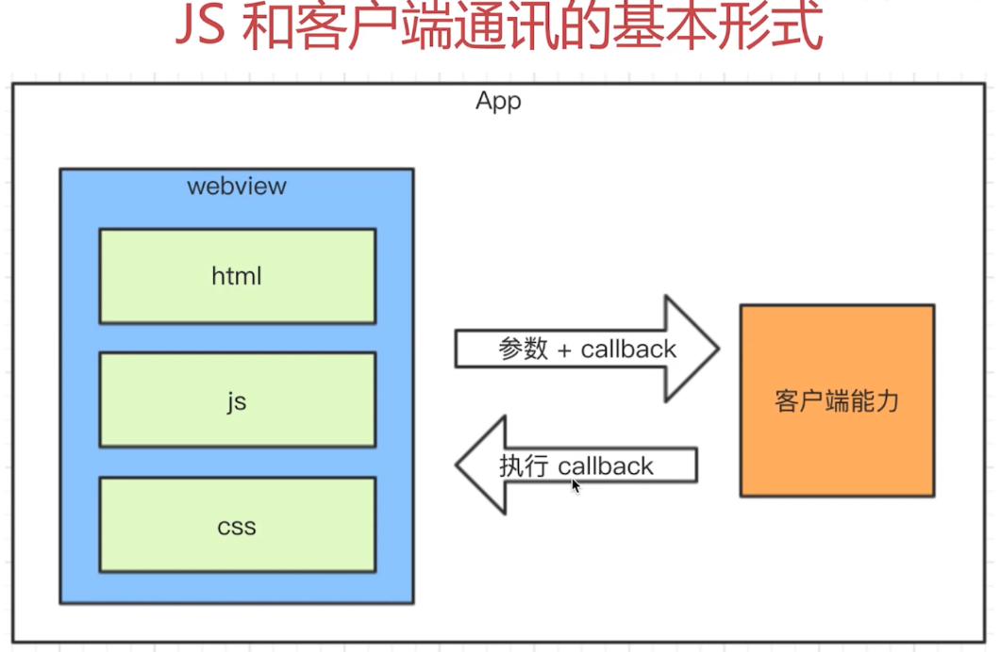

# hybrid

:::tip
客户端app和前端混合开发

需要前端开发客户端开发配合完成

某些环节涉及 `server` 端

核心意义：快速迭代，无需审核
:::

## hybrid 是什么

- `hybrid` (混合)

  - 无需 `app` 审核，可以快速迭代更新

  - 体验流畅 NA基本类似

  - 减少开发和沟通成本，共用一套代码

- `webview`

  - `app` 的一个组件，可有可无。
  
  - 用于加载 h5页面，小型浏览器内核

- file:// 协议(hybrid) 快

  - 协议 标准

  :::tip 协议
  `http`  加载远程 网络加载  慢
  
  `https`
  
  `file`  加载本地文件 快
  :::

- `hybrid` 实现流程(把前端静态htmlcssjs通过file协议放在webview)

  - 前端做好静态文件，给客户端

  - 客户端以本地文件形式存储在 `app`

  - 客户端在 `webview` 中使用 `file` 协议加载静态页面

  

- 具体实现 - 遗留问题

  - `app` 发布后，静态文件如何实时更新

  - 静态页如何获取内容

## hybrid 更新上线流程(前端上传添加版本号，客户端对比，下载新包，进行覆盖)

- 替换每个客户端静态文件

- 客户端去 `server` 下载最新的静态文件

- 前端维护 `server` 静态文件

- 完整流程

  :::tip
  对比版本  不一样去下载
  :::

  

  - 前端打包上传  分版本 时间戳版本号

  - app客户端每次启动 去服务端检查版本号 大于客户端版本号 去下载zip解压

  - 现有文件覆盖

## `hybrid` `h5` 区别(产品，运营一个页面)

- 优点

  - 体验更好

  - 可快速迭代

- 缺点

  - 开发成本高  联调、测试、查 bug 麻烦

  - 运维成本高 上传解压..

- 适用场景

  - `hybrid` **产品功能稳定** 体验要求高  迭代频繁

  - `h5` 单次 **运营** 活动或不常用功能(红包)  会白屏  加载条

## 前端 `js` 和客户端通讯

- 前端如何获取新闻内容？

  - 不能 ajax, 跨域速度慢

  - 客户端获取内容，js 通讯拿到内容，再渲染

  

- `js` 和客户端通讯基本形式 (调用能力，传递参数，监听回调)

  - js 访问客户端能力，传递参数和回调函数

  - 客户端通过回调返回内容

- `schema` 协议

  :::tip
  前端客户端通讯的约定标准

  通过 iframe 使用

  封装完成之后内置上线
  :::

  - 内置上线

    - `schema` 协议封装代码打包，`invoke.js` 内置到客户端

    - 客户端每次启动 `webview`，默认执行 `invoke.js`

    - 本地加载更快

    - 本地加载没有网络请求，黑客看不到 `schema` 协议，更安全