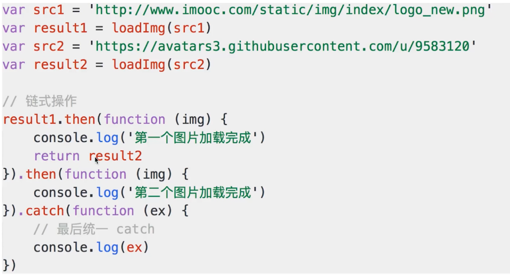

# 异步

## 什么是单线程和异步关系

:::tip
同时只能做一件事，两段 js 不能同时执行

异步算是一种解决方案
:::

### 单线程

**同一时间只能做一件事**：

```js
console.log(100)
alert('hello')
console.log(200)
```

**原因： 避免 DOM 渲染冲突**：

:::tip
js 单线程

和浏览器渲染线程共用一个线程
:::

- 浏览器需要渲染 DOM

- js 可以修改 DOM

- js 执行，浏览器 DOM 渲染会暂停

- 两段 js 不能同时执行(都修改 dom 会冲突)

- webworker 支持多线程  但是不能访问 Dom

**解决方法： 异步**：

```js
// setTimeout
console.log(100)

setTimeout(() => {
  console.log(200)
}, 1000);

console.log(300)
```

```js
// ajax
console.log(100)
$.ajax({
  url: 'xx',
  success:function (result) {
    console.log(result)
  }
})
console.log(300)
```

### 异步缺点

- 没按照书写方式执行，可读性差

- callback 中不容易模块化

## 什么是 event-loop 事件轮询 事件循环

### event-loop

:::tip
js 异步具体解决方案
:::

- 同步代码，直接执行

- 异步函数放在 异步队列 (直接，延时，ajax成功之后)

- 待同步函数执行完毕，轮训执行 异步队列 函数

## 如果只用 jquery 如何解决异步

:::tip
jQuery 1.5 的变化

无法改变 js 异步和单线程的本质

只能从写法上杜绝 callback 形式 (success error)

是种语法糖 解藕代码

开放封闭原则---对扩展开放 对修改封闭 (23设计模式 5个设计原则)
:::

- jQuery 1.5

  - 1.5 之前

    - `$.ajax` 返回 `XML` 对象 (success callback 函数)

  - 1.5 之后

    - `ajax.done` `.fail` 返回 `deferred` 对象

    - `ajax.then`

  - `jQuery` 的 `deferred`

    - dtd API 分为两类

      - 第一 `dtd.resolve`、`dtd.reject` 主动执行

      - 第二 `dtd.then`、`dtd.done`、`dtd.fail` 被动监听

      :::tip
      这两类要分开
      :::

    - `dtd.promise` 返回 `promise` 对象

      - `promise` 对象只能被动监听 `.then`

## promise

### 基本使用和原理

#### 基本语法

```js
 function load(src) {
      var promise = new Promise((resolve, reject) => {
        var img = document.createElement('img')
        img.onload = function () {
          resolve(img)
        }
        img.onerror = function () {
          reject()
        }
        img.src = src
      })
      return promise
    }

    var src = 'https://timgsa.baidu.com/timg?image&quality=80&size=b9999_10000&sec=1537653591720&di=c2e275aa2d9a8029bd0e9af1e6550b94&imgtype=0&src=http%3A%2F%2Fimg.tupianzj.com%2Fuploads%2Fallimg%2F20161205%2F0F7MYI8rYq303.jpeg'
    var result = load(src)
    result.then(function (img) {
      console.log('success', img.width)
      return img
    }, function () {
      console.log('error')
    }).then(function (img) {
      console.log('success', img.height)
    })
```

#### 异常捕获

进行异常捕获时，`.then`只能接受一个参数，最后统一用 `catch` 捕获异常

```js
// 逻辑之内
 result.then(function (img) {
      console.log('success', img.width)
      return img
    }).then(function (img) {
      console.log('success', img.height)
    }).catch(function(e){
      console.log(e)
    })
```

```js
// 逻辑之内
img.onload = function () {
            resolve(img)
          }
          img.onerror = function () {
            reject('图片加载失败')
          }
```

#### 多个串联 先后顺序 链式操作

:::tip
return result2

返回的 result2 的 .then
:::



#### Promise.all Promise.race

:::tip
接受 promise 对象的 **数组**
:::

- `Promise.all`  全部完成，统一执行 success `datas`

```js
Promise.all([result1, result2]).then(datas => {
  console.log(data[0])
  console.log(data[1])
})
```

- `Promise.race` 只要一个完成，执行 success `data`

```js
Promise.race([result1,result2]).thne(data => {
  console.log(data)
})
```

#### promise 标准

- 标准

  - 三种状态：`pending`、`fulfilled`、`rejected`

  - 初始状态 `pending`

  - `pending` 变 `fulfilled`, `pending` 变 `rejected`

  - 状态变化不可逆

- .then

  - 必须有 `.then()`

  - 必须接受两个函数为参数

  - 必须返回一个 promise 实例

## async/await 使用 ES7（和promise 区别联系）

### koa

### then 将 callback 拆分了

### async/await 直接写同步

### 语法

- 使用 await, 函数必须有 async 标识

- await 后面跟一个 promise 实例

- 需要 babel-polyfill

```js
const load = async function() {
  const result1 = await loadImg(src1)
  console.log(result1)
  const result2 = await loadImg(src2)
  console.log(result2)
}

load()
```

:::tip
`promise` 是对异步回调的封装 通过 `.then` 使用

`async/await` 使用了 `promise`、用同步写法 没有回调函数  

使用中的扩展 完美结合

**无法改变js 单线程异步本质**
:::

### 当前异步解决方案

- jQuery deferred

- Promise

- Async/Await

- Generator 原理复杂 遍历器 代替方式 不是直接方式