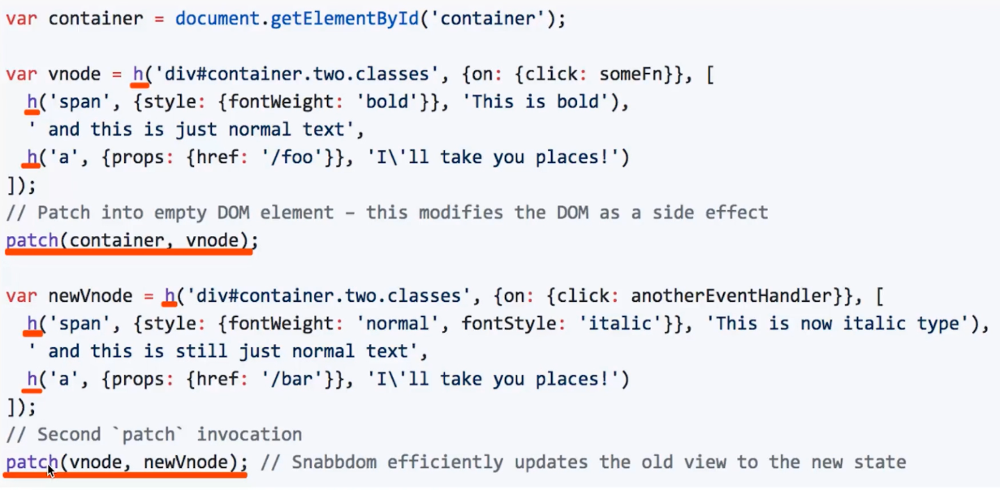

# vdom

## 什么是 `vdom`

### 为何用

:::tip
浏览器最耗费性能的是 dom 操作 最昂贵

js 运行效率高
:::

### virtual dom 虚拟 dom

### js 模拟 dom 结构

```html
<ul id='list'>
  <li class='item'>item 1</li>
  <li class='item'>item 2</li>
</ul>
```

```js
{
  tag: 'ul',
  attr: {
    id: 'list'
  },
  children: [
    {
      tag: 'li',
      attr: { className: 'item'},
      children: ['item 1']
    },
    {
      tag: 'li',
      attr: { className: 'item'},
      children: ['item 2']
    },
  ]
}
```

### dom 变化对比 js 层来做

### 提高重绘性能

## `vdom` 如何使用 核心API函数有哪些

- h('标签名', {属性}, [子元素...])

- h('标签名', {属性}, '...')

- patch(container, vnode)

- patch(vnode, newVnode)

### snabbdom

[snabbdom](https://github.com/snabbdom/snabbdom)



- `h`、`patch`

  - `h`生成 `vnode` 节点

  - `patch(container, vnode)` 渲染到 `container`  

- `vdom` 节点 `vnode`

## `diff` 算法

- 什么是 diff 算法

虚拟dom 的 diff 算法

- vdom 为何用 diff 算法

  :::tip
  找到更新的节点
  :::

  - dom 操作昂贵

  - 找到更新的节点更新 其他不更新

  - "找" 这个过程就是 diff 算法

- diff 实现流程

  - `patch(container, vnode)`

  - `patch(vnode, newVnode)`

- 核心逻辑

  - `createElement`

  - `updateChildren`

  ```js
  // patch(container, vnode)
  function createElement(vnode) {
    ...
    // 创建元素
    var elem = document.createElement(tag)
    // 属性
    var attrName
    ...
    elem.setAttribute()
    // 子元素 递归调用 createElement 创建子元素
    // elem.appendChild(childElem)
    elem.appendChild(createElement(childVnode))
    return elem
  }
  ```

  ```js
  // patch(vnode, newVnode)
  function updateChildren(vnode, newVnode) {
    children.forEach((child, index) {
      if(child.tag === newChild.tag) {
        // 一样
        updateChildren(child, newChild)
      }else {
        // 不一样
        replaceNode(child, newChild)
      }
    })
  }
  ```