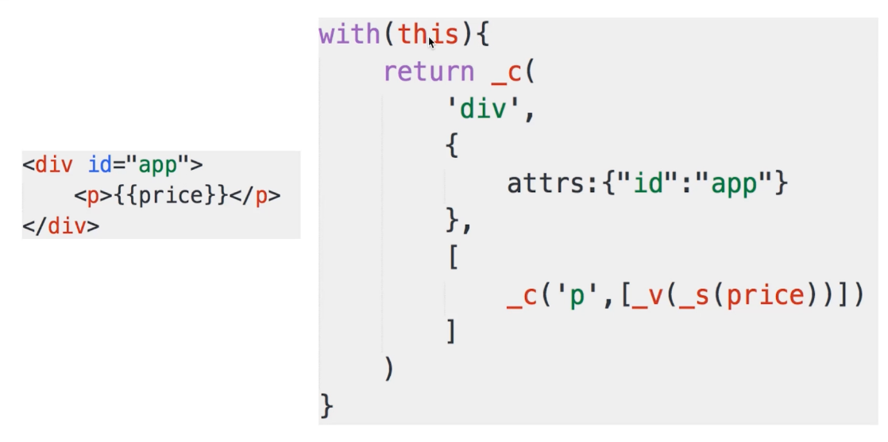
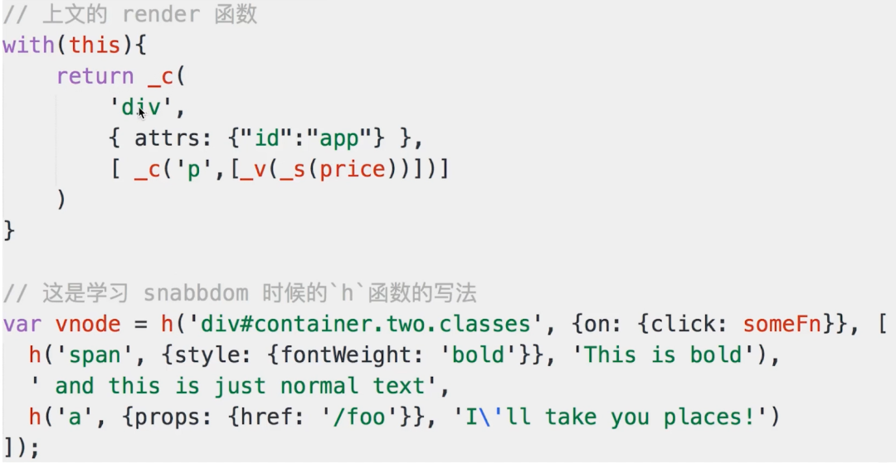

# MVVM 和 Vue

## jquery vue react 区别

### jquery 实现 todolist

```html
<div>
    <input type="text" id="txt-title">
    <button id="btn-submit">submit</button>
  </div>
  <div>
    <ul id="ul-list"></ul>
  </div>
```

```js
var $txtTitle = $('#txt-title')
    var $btnSubmit = $('#btn-submit')
    var $ulList = $('#ul-list')

    $btnSubmit.click(function () {
      var title = $txtTitle.val()
      if (!title) {
        return
      }
      var $li = $('<li>' + title + '</li>')
      $ulList.append($li)
      $txtTitle.val('')
    })
```

### vue 实现 todolist

```html
<div id="app">
    <input type="text" v-model="title">
    <button @click="add">submit</button>
    <ul>
      <li v-for="item in list">{{item}}</li>
    </ul>
  </div>
```

```js
var vm = new Vue({
      el: '#app',
      data: {
        title: '',
        list: []
      },
      methods: {
        add() {
          this.list.push(this.title)
          this.title = ''
        }
      }
    })
```

### 对比（核心2个区别）

- 数据和视图分离，解藕(开放封闭原则)

- 数据驱动视图，只关心数据变化，dom 操作被封装

## 如何理解 MVVM

### MVC

- model(数据模型)

- view(视图)

- controller(控制器)

### MVVM

- model(数据模型) data 数据对象

- view(视图) 模版页面

- vm-(viewModel)(连接) 视图模型(vue 实例)

### viewModel

:::tip
连接 view model

var vm = new Vue()

事件绑定 `dom listeners`

数据绑定 `data bindings`
:::

### MVVM（vue）三要素

:::tip
数据代理

`Object.defineProperty()` 给 `vm` 添加和 `data` 对象属性对应的属性描述符(get,set)

`get`、`set` 内部操作 `data` 队形的属性数据

模版解析 -- compile -- 初始化视图 -- 订阅数据变化，绑定函数 bind -- new watcher(vm,exp){updaterFn(表达式对应属性值变化时调用，更新界面中的指定节点)}(为表达式创建一个对应的 watcher,实现节点更新显示) -- 更新视图

1.取出el元素所有子节点保存在 `fragment` 对象
this.$fragment = this.node2Fragment(this.$el)

2.编译 `fragment` 所有层次子节点,递归进行编译处理 `this.init()`

- 大括号表达式文本节点

  - 表达式 `me.compileText` {{name}}

    - 正则匹配出表达式字符串 RegExp.$1 --- `"name"`

    - `data` 取出表达式对应的属性值 --- `value`

    - 将 `value` 属性值设置为文本节点的 `textContent`

- 元素节点指令属性

  - 指令 `me.compile`

    - 事件指令 v-on:click

    1. compileUtil.eventHandler -- eventType --- 事件回调函数(绑定this为vm)

    2. 给节点绑定指定事件名回调函数的 dom 事件监听

    3. 解析完，移除指令属性

    - 一般指令

    compileUtil[dir] (编译指令)

    1. 得到指令名 v-text/html/class msg

    2. data 得到对应的值

    3. 根据指令名确定操作什么属性(v-text/textContent,v-html/innerHTML,v-vlass/className)

    4. 将表达式值设置到对应属性

    5. 移除元素指令属性

3.编译好的 `fragment` 添加到 `el` 元素
this.$el.appendChild(this.$fragment)

数据绑定

- 数据绑定 (更新 data、自动改变视图)

  - 初始化显示 从 data 读取数据显示(模版解析/编译)

  - 更新显示 更新 data 属性数据

- 数据劫持(vue 实现数据绑定的技术)

  - 通过 defineProperty() 监视 data 中所有属性数据的变化(get/set)，更新界面

  (vm 里面的 set 数据代理、 data 里面的 set 数据绑定)

- 四个对象

  1. Observer(必须是一个对象)   劫持监听所有属性--通知变化 -- dep -- 通知变化 --- watcher

  > 创建一个对应的观察者(Observer对象)，保存 data,开始对 data 的监视(walk)，保存observer对象，遍历data 中所有属性，对指定的属性实现响应式(defineReactive)数据绑定

  - defineReactive 递归(Observer)找出所有层次的属性

    - 创建属性对应的 dep(dependency) 对象

    - 间接递归调用对 data所有属性进行数据劫持

    - 给 data 重新定义属性(object.defineProperty)，添加(get(返回值，建立dep 和 watcher之间的关系)/set(监视key属性的变化，更新界面，通知所有相关 dep.notify(watcher))方法

    - notify 遍历所有 watcher 更新 (sub.update())

    - addSub 添加 watcher 到 dep

    - depend 建立dep 和 watcher之间的关系

    - removeSub 移除

  2.dep 初始化给 data 属性进行数据劫持时创建的

      - dep个数和data中的属性一一对应

      - dep结构

        - id: uid++ 作为标识

        - subs:[ ] 所有相关的 watcher 容器

  3.watcher 初始化解析大括号表达式/一般指令时创建

      - 个数 与模版中表达式(除事件指令)一一对应

      - 结构

        - this.cb = cb  // 更新界面的回调

        - this.vm = vm  // vm

        - this.exp = exp // 对应表达式

        - this.depIds = {} // 相关 dep 容器对象

        - this.value = this.get() // 当前表达式对应的 value

      - update -- this.run()

      - run -- this.cb.call(this.vm, value, oldVal) 回调函数更新界面

      - get 表达式的值 建立 dep 与 watcher 的关系

        - dep.target 给 dep 指定当前的 watcher

        - var value = this.getVMVal() 获取表达式的值，内部调用 get 建立dep和watcher关系

        - Dep.target = null 去除 dep 中指定的当前 watcher

        - return value

      - addDep 判断dep 与 watcher 关系是否已经建立 if(!this.depIds.hasOwnProperty(dep.id))

        - dep.addsub()将 watcher 添加到 dep, 用于更新

        - this.depIds[dep,id] = dep将dep 添加到 watcher中，用于防止重复建立关系

      - dep 和 watcher 关系

      - 多对多

        - data 属性(a)  -- dap  -- n 个 watcher(属性在模版中多次使用)({{a}}/v-text="a")

        - 表达式(a.b.c) -- watcher - n 个 dep (多层表达式)

      - 如何建立关系

        - 解析模版 - 创建 watcher(内部调用get, 获取表达式的值get--dep.depend()
        )

      - data 中属性的 get() 中建立

      - 初始化解析模版表达式时建立，创建 watcher 对象时

  4.compile

  - object.defineProperty(data, key)

  
:::

- 响应式
  
  - model // 解析v-model

    - bind

      - modelUpdater() {node.value}

      - new watcher(为表达式创建watcher)

  - node.addEventListener('input'(输入改变时触发),( ){ 判断 me._setVMVal(vm, exp, newValue)} -- set) 通知 dep 通知 watcher

    - input 的 value 发生变化，将最新的值赋值给当前表达式对应的 data 属性

  :::tip
  Object.defineProperty() 方法会直接在一个对象上定义一个新属性，或者修改一个对象的现有属性， 并返回这个对象。
  :::

  - Object.defineProperty 给属性添加 get set方法

    - 获取 get

    - 设置 set

  - data 属性 代理到 vm

- 模版引擎

  - 模版是什么

    - 本质：模版就是字符串,模版字符串，最终转换 html 展示

    :::tip
    和 html 区别

    类似 html,但是有逻辑

    html 展示 静态的

    模版字符串动态的
    :::

    - 有逻辑，如 v-if、v-for...

    - 最终必须转换成 js 代码

      :::tip
      1. 因为有逻辑 v-for、v-if...

      2. 模拟最终要渲染在页面，要转换成 html, js 才能把 html 渲染在页面(render)
      :::

- 模版渲染

## render 函数

### with 函数

  :::tip
  平常不建议用 很多问题

  调试问题
  :::

  ```js
  // 不用 with
  function fn() {
    alert(obj.name)
    alert(obj.age)
    obj.getAddress()
  }
  fn()

  // 使用 with
  function fn1() {
    with(obj) {
      alert(name)
      alert(age)
      getAddress()
    }
  }
  fn1()
  ```

### render 如何实现



- _c  createElement

- _v  createTextVNode

- _s  toString

#### vdom 核心API

- h 创建虚拟节点

- patch 渲染到真实的 dom 节点

#### render 函数 和 vdom



:::tip
vm.c 相当于 snabbdom 的 h 函数

render 函数(vm.c) 返回 vnode

页面首次渲染执行 updateComponent

data 每次修改执行 updateComponent
:::

```js
vm._update(vnode) {
  const preVnode = vm._vnode
  vm._vnode = vnode
  if(!preVnode) {
    vm.$el = vm.___patch__(vm.$el,vnode)
  } else {
    vm.$el = vm.___patch__(preVnode,vnode)
  }
}

// data 每次修改执行 updateComponent
function updateComponent() {
  // vm._render 返回 vnode
  vm._update(vm._render)
}
```

## 总结

- 模版

  - 字符串，逻辑

  - 模版转为 js(逻辑，渲染 html，js 变量)

  - render 函数 (with,_c)

  - render 最终返回 vnode

  - updateComponent 对比 2种情况 patch

### vue 整体实现过程

- 解析模版成 render 函数

  - with

  - data 属性变成 js 变量

  - v-for.. 变成 js 逻辑

  - render 返回 vnode

- 响应式开始监听

  - object.defineProperty() get set

  - data 属性代理到 vm

- 首次渲染，展示页面，绑定依赖
  
  - updateComponent 执行 vm.render

  - 会访问到 vm.list  
  
  - 被响应式 get 监听到

  - patch(vm.$el, vnode) 初次渲染完成

- data 属性绑定，触发 rerender

  - 修改属性，被 set 监听到

  - 执行 updateComponent 重新 vm.render

  - 申城 vnode 和 preVnode， patch 对比

  - 渲染到 html