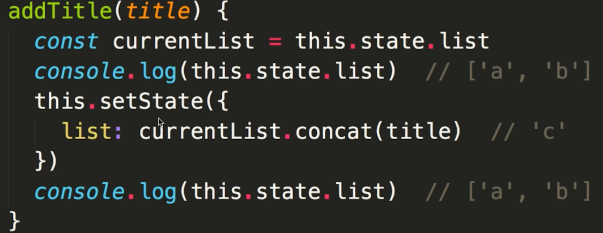

# react

```bash
$ sudo npm i create-react-app -g

$ create-react-app react-test

$ cd react-test

npm start
```

## 组件化的理解

### 组件的封装

- 视图

```js
this.state = {
  title: ''
}
```

- 数据

```js
<div>
  <Input addTitle={this.addTitle.bind(this)}/>
  <List data={this.state.list}/>
</div>
```

- 组件内部变化逻辑(数据驱动视图变化)

```js
this.setState({
  list: currentList.concat(title)
})
```

### 组件的复用

:::tip
模版

通过 props 传递
:::

## `JSX`本质是什么

:::tip
本质是语法糖 需要解析成 js 才能运行(React.createElement)
:::

### jsx 语法

- html 形式

```js
const name = 'zhangsan'

<p>{name}</p>
```

- 引入 js 变量和表达式

- if...else

- 循环

- style 和 className

```js
const styleConfig = {
      fontSize: '40px',
      color: 'pink'
    }

<p style={ styleConfig }>{name}</p>
```

### jsx 解析成 js

:::tip
jsx 语法 浏览器无法解析

最终解析成 js 执行
:::

- jsx 解析 生成 vnode

```js
var profile = <div></div>
```

```js
// 解析结果
var profile = React.createElement("<div", null,)
```

- React.createElement 参数说明

```js
// 标签名， 属性，子元素（所有的参数/数组）
React.createElement("<div",{id:'div1'},child1, child2,child3)
React.createElement("<div",{id: 'div1'},[...])

// ex
<div>
  <Todo />
</div>

React.createElement(
  "div",
  null,
  React.createElement(Todo, null)
);

var todo = new Todo()
return todo.render()
```

### 独立的标准

:::tip
`jsx` 是 `React` 引入的， 但不是独有

`createElement` 可以自定义修改( `Preact` 用的 `h`)---/* @jsx h */

标准化 本身功能完备 兼容扩展性没问题
:::

## `JSX` 和 `vdom` 关系

:::tip
JSX 语法糖是模版，最终需要渲染成 html。需要 vdom

JSX 需要转为 js 代码，js 不会亲自操作 dom, 中间层 vdom 渲染
:::

### vdom

:::tip
核心API

h

patch
:::

- vdom 是 React 推广的，结合 jsx

- jsx 就是模版，最终渲染成 html

- 初次渲染 + 修改state 后的 re-render

### React.createElement 和 h

都生成 vnode

### 何时 patch

- 初次渲染 - ReactDom.render( < App/>, container)

- 会触发 patch(container, vnode)

- 再次渲染 re-render - setState

- 会触发 patch(vnode, newVnode)

### 自定义组件解析

- 传入构造函数

```js
React.createElement(List, { data: this.state.list }) // 返回 vnode

var list = new List({ data: this.state.list })
var vnode = list.render() // 返回 jsx 返回 vnode

// ex
var app = <App />
var app = React.createElement(App, null);

var app = new App()
return app.render()
```

:::tip
class 类型

如是自定义组件

React.createElement(第一个参数))

第一个参数是 div "字符串"/自定义组件 "自定义构造函数名(class 名)"
:::

- 'div' `直接渲染即可，vdom` 可以做到

- `Input` 和 `List`,自定义组件(class), `vdom` 不认识

- 自定义组件定义时必须声明 `render` 函数

- 根据 `props` 初始化实例，执行实例的 `render` 函数

- `render` 函数返回 `vnode` 对象

## `react` 的 `setState` 异步

### setState 过程



- setState 的异步

  - 为何需要异步

    - 可能一次会执行多次 setState

    - 无法规定用户如何使用 setstate

    - 没必要每次 setState 都重新渲染，性能

    - 即便每次都重新渲染，用户也看不到中间的效果

- vue 修改属性也是异步

  - 效果原因和 setstate 一样

  - 对比

  - vue 渲染流程

    - 解析模版成 render 函数

    - 响应式监听

    - 首次渲染，显示页面，且绑定依赖

    - data 属性变化，触发 rerender(set监听属性没有异步、set中的 updateComponent是异步)

- setState 过程

  - 每个组件实例，都有 renderComponent 方法

  - 执行 renderComponent,会重新执行实例的 render

  - render 函数返回 newVnode, 然后拿到 preVnode

  - 执行 patch(preVnode, newVnode)

  ```js
  // setstate 第二个参数
  this.setstate({
    list: currentList.concat(title)
  },() => {
    // console.log(this.state.list)
    this.renderComponent()
  })
  ```

## 比较 `React` 和 `vue`

### 本质区别

- vue 本质 MVVM 框架，由 MVC 发展而来

- React  本质是前端组件化框架，有后端组件化发展而来

### 看模版和组件化区别

- 模版区别

  - vue-使用模版(最初有 angular 提出)

  - React-使用 JSX

  - 模版语法 倾向 JSX(学习成本比较低))

  - 模版分离 倾向 vue(React 模版形式上和 js 逻辑未分离)

  ```js
  <div>
    <h1 v-if="ok">Yes</h1>
    <h1 v-else>No</h1>
  </div>

  <div>
    { ok ? <h1>Yes</h1> : <h1>No</h1>}
  </div>
  ```

- 组件化的区别

  - React 本身就是组件化

  - vue 支持组件化，不过是在 MVVM 上的扩展

### 共同点

- 都支持组件化

- 数据驱动视图

:::tip
国内使用vue，文档更易读、易学，社区够大

团队水平高，React，组件化、jsx
:::