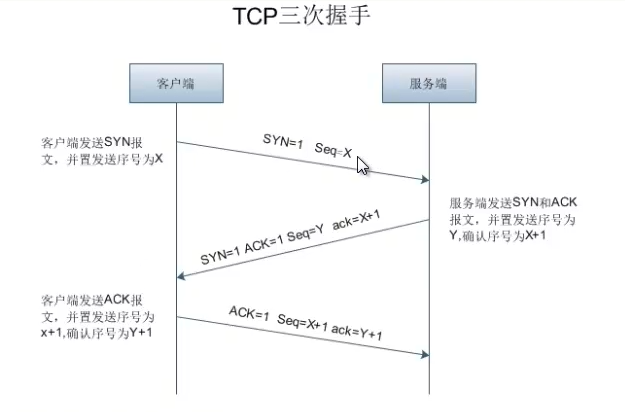
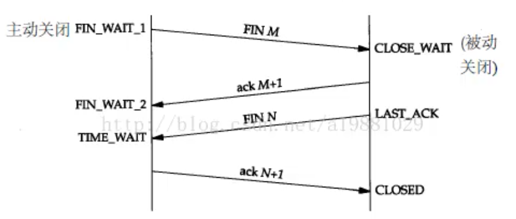

# 协议

## http

- 1.1 版本(98-)

## web 系统基础

### 网络体系架构

- B/S Browser/Server: Apache、IIS、Tomcat、Ngix、Lighttp..

- C/S Cline/Server: QQ、微信..

- P2P point to point

### B/S vs C/S 区别

- 标准、规范

  - B/S 是标准规范

  - C/S 不标准，自定义

- 运算能力

  - B/S 核心运算全在服务器

  - C/S 客户端和服务器端都可以承担元算职责(可减少服务器资源消耗)

- 部署

  - B/S 部署方便，只需要部署服务器端

  - C/S 部署麻烦，需同时升级客户端和服务器端

## web 核心技术

### web 工作过程

- 输入 url 地址(`http://www.baidu.com/`)

  - url 地址

    - 协议类型 `http`

    - 主机名 `www.baidu.com` 域名 `DNS` 解析

    - 端口号 `http` 默认 `80`

    - 访问页面文件 `/` 根目录 默认首页

    - 附加部分：`url` 地址参数

### web 客户端技术

- 浏览器工作原理

  - 页面渲染(渲染引擎)

    - Trident IE(微软)、360

    - Gecko Fixfox、mozilla

    - webkit/KHTML safari、Google Chrome

    - Presto Opera

  - javascript 解析和执行

  - 网络处理
  
  - 数据保存、缓存等附加功能

- 常用客户端技术手段

  - ajax

  - ActiveX 专门针对IE(类似网银控件)

  - 其他浏览器扩展插件 提升浏览器处理能力

  - Flex - 富客户端

  - silverlight 准对IE

### web 服务端技术

- 核心功能

  - 处理客户端请求(http)

  - 对客户端发送过来的请求进行响应

    - 监听

    - 回应

    - 响应

  - 客户端和数据库之间的中介

    - 三层架构： C-S-D(客户端-服务器-数据库)

    - N 层架构

      - web 前端服务器

      - 应用服务器

      - 数据库端

- 常用 web 服务器技术

  - Apache

  - IIS

  - Tomcat 主要处理 java 动态页
  
  - Ngix
  
  - Lighttp

## web 网络协议

### 网络协议模型

- 协议

:::tip
规则：相同语言、相同语法规则

网络通信：TCP/IP、通信协议、蓝牙协议、WI-FI 协议规范
:::

- OSI 网络模型 (开放式系统互联 (open system interConnection))

参考模型、不是强制标准

国际标准化组织(OSI) 制定了 OSI 模型。

这个模型把网络通信工作分为7层：物理层、数据链路层、网络层、传输层、会话层、表示层、应用层

物理层：光纤 物理连接

数据链路层：网卡、交换机

网络层：IP 地址(网络层地址) 进行不同网络间的路径选择 路由器

传输层： TCP 端口 标识别特定程序 建立连接

会话层： session 会话连接

表示层： 加密解密数据安全、数据压缩

应用层： 用户界面

- TCP/IP：简化四层

  - 应用层(应用层、表示层、会话层)

  - 传输层(Transmission Control Protocol) **TCP 头 = 上层数据**

  - 网络层(Internet Protocol) **IP 头 = TCP + 上层数据**

  - 网络访问层(数据链路层、物理层) **LLC 头 = IP + TCP + 上层数据** - **MAC头 = LLC + IP + TCP + 上层数据** - **二进制**

- TCP 协议 **传输控制**协议(Transmission Control Protocol)

  - 建立连接

    - 三次握手

      - 客户端发送自己的 `SYN` 包给服务器, 进入 `SYN_SENT` 状态， 等待服务器确认

      - 服务器接受到客户端 `SYN` 包， 发送一个 `ACK`,发送自己的 `SYN`, 进入 `SYN_RECV` 状态

      - 客户端接到服务器发送的 `SYN+ACK`, 进入 `EATABLISHED` 状态，并发送服务器 `SYN` 包确认 `ACK`,服务器接到客户端 `ACK` 后，进入`EATABLISHED` 状态

      **都进入 `EATABLISHED` 状态，客户端服务器开始双向传递数据**

      

    - UDP 协议(user diagram Protocol) 简单 没有三次握手 1.可靠性差 2.性能好

  - 关闭连接

    - 四次挥手

      - 主动关闭方发送 `FIN` 进入 `FIN_WAIT1` 状态

      - 被动方接收主动关闭方发送的 `FIN` 并发送 `ACK`，被动方进入 `CLOSE_WAIT` 状态，主动关闭方接收到被动`ACK` 后，进入 `FIN_WAIT2` 状态

      - 被动关闭方发送一个 `FIN`,进入 `LAST_ACK` 状态

      - 主动方收到被动方发送的 `FIN` 并发送 `ACK`, 主动方进入 `ITME_WAIT` 状态， 2MSL 时间后关闭连接，被动方收到主动方的 `ACK`，关闭连接

      

  - 保证可靠性

- Wireshark 应用

  - 协议监控工具

  - sniffer

  - omnipeek

- IP 协议及其他

## HTTP 协议

### HTTP 协议简介(HyperText Transfer Protocol)

:::tip
HTTPS

SOAP
:::

- 协议规则：内容本身

- http 特点
  
  - 1.传输明文内容，安全性差

  - 2.无状态协议

  - 3.应用层协议、标准化协议1.1版本

### HTTP 请求

- 常用

  - get 获取资源

  - post 发送提交新数据

- 不常用

  - head

  - options

  - put

  - delete

  - trace

### HTTP 响应

### HTTP-session

- http 无状态

- session ID 保存在服务器

### HTTP-cookie

- 保存在客户端

### Fidder 协议捕获与编辑

## web 前端分析

### 浏览器渲染原理

### 优化

- 浏览器缓存

  - 服务器响应内容缓存

  - cache-control: xxx

  - Expires: xx:xx:xx

- 减少 http 请求数量

  - 减少请求重定向 /

  - 减少预处理时间

  - 减少 TCP 连接时间

  - 减少发送请求时间

  - 减少服务器硬盘 IO 时间 雪碧图

  - 减少浏览器渲染时间

- GZIP 压缩：只针对文本有效(html、css、js)

  - 减少内容本身大小(空格、tab、变量名短、注释..)

  - 使用 GZIP 传输过程中压缩

- css 放 http 开头

- js 放 html 结尾

- 减少 DNS 查找

- 静态文件压缩

- 使用 CDN

## web 安全性

### 认证授权

- 认证

- 权限

- 避免未经授权的页面可以直接访问

### session 与 cookie

- sessionID

- 避免保存敏感信息在 cookie

- 作用域-不同应用系统不同作用域

### DDOS 拒绝服务攻击

- 疯狂想服务器发请求

- 分布式

### 文件上传漏洞

- 限定长传格式(脚本)

- 通过后缀名过滤

- 通过二进制判断文件类型

- 禁止脚本引擎运行系统命令

### XSS 跨站攻击

:::tip
跨站脚本攻击(cross site scripting)

web 页面插入恶习代码
:::

- 伤害用户

- 钓鱼网站

### SQL 注入

- 输入

- 最通用攻击手段

- 依赖数据库

- 利用 SQL 注入

  - 服务器端长度没有验证

  - 猜测表明，列名，加密方式

- 利用 url 地址参数注入

### 暴力破解

- 试密码