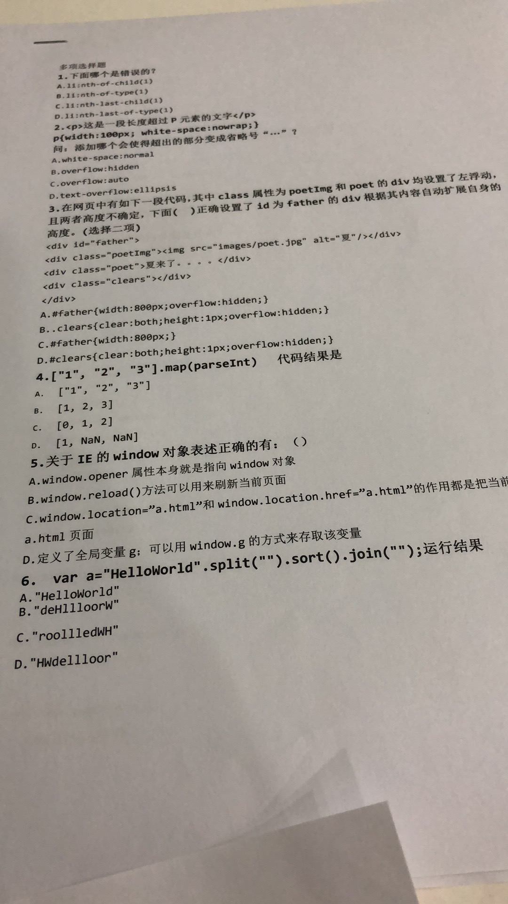
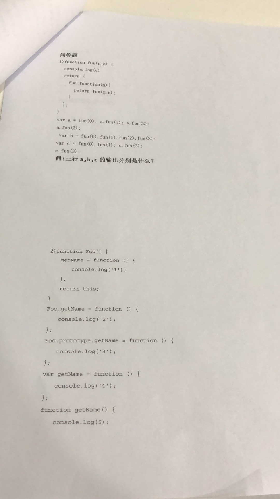
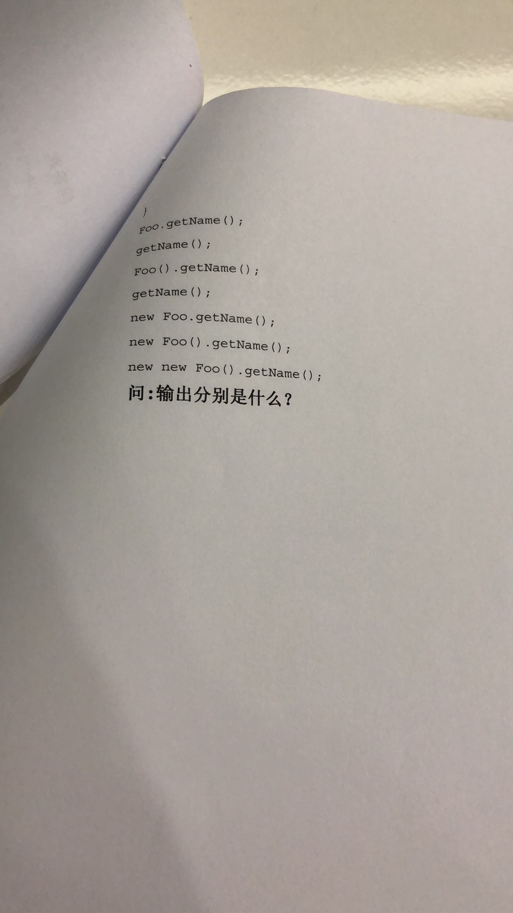

# 10_10

## 答案

### 多选

1.A

:::tip
nth-child 子元素个数

nth-type 子元素类型
:::

2.B、D

设置宽度，强制不换行，text-overflow: ellipsis

### 问答

### 面试

1.rem

2.rpx

3.px2rem

4.flex 容器属性

- flex-direction(主轴方向)

- flex-wrap(换行)

- flex-flow(direction flex-wrap缩写)

- justify-content(主轴对齐方式)

- align-items(交叉轴对齐方式)

- align-centent(多轴对齐方式,一根轴线，没用)

5.flex 项目属性 子元素(容器成员)

- order(子元素排列顺序，默认0，最小的在前面)

- flex-grow(子元素放大比例，0默认不放大，1剩余等分，2两倍)

- flex-shrink(缩小比例，1默认等比缩小，0不缩小)

- flex-basis(项目占据主轴空间，计算剩余空间，默认auto，本身大小)

- flex(flex-grow,shrink,basis默认(0，1，auto))

- align-self(允许不一样的对齐方式，可覆盖align-items,默认auto)

6.子元素撑起父盒子

7.sort 数组排序

:::tip
sort() 无参数 按字母顺序排序(字符编码顺序) 升序
sort 会调用数组的toString() 转为字符串排序

例如：
var values = [0,1,5,10,15];
values.sort();
alert(values); //0,1,10,15,5
:::

8.split()字符串分割称字符串数组

:::tip
split(separator,howmany)
separator 必须 字符串或正则 指定地方分割
howmany 可选 返回最大长度
:::

9.join(separator) 数组中所有元素放入字符串

:::tip
separator 可选 指定使用的分隔符
默认逗号
:::

10.map(parseInt)

11.闭包

- var

12.原型

13.this

14.尺寸单位

- 1 rpx = 屏幕宽度/750 px

- 1 rem = px/100 100px= 1rem

:::tip
document.documentElement.style.fontSize = document.documentElement.clientWidth / 7.5 + ‘px‘;
:::